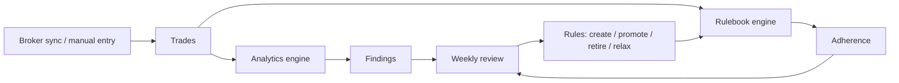

# Retrospeq

Retrospeq is a trading journal that asks **"was this a good decision?"**,
never "did this trade make money?". There's no currency P&L on the home
screen and no red/green anywhere — outcome and process are tracked as two
separate, honest signals instead of one number that rewards luck.

Three objects hold the whole product together:

- **Strategy** (many, per trader) → produces **Findings** — statistical
  facts about how a strategy actually performs, surfaced only once the
  data honestly supports them ("not enough data yet" is a correct state,
  not a bug).
- **Rulebook** (one, per trader) → produces **Adherence** — did the
  trader follow the rules they wrote for themselves. Adherence earns no
  XP, ever; it isn't a game.
- **Field registry** (one, per trader) → the shared vocabulary both
  Strategy and Rulebook are built on (a handful of permanent derived
  fields plus whatever custom fields a trader defines).

The test for which bucket something belongs in: **can it be violated? →
Rulebook. A fact about what happened? → Strategy.**



## Stack

Next.js 16 (App Router, `proxy.ts` not `middleware.ts` — see
`AGENTS.md`'s opening note on API drift), React 19, TypeScript, Zod,
`decimal.js` for all money/ratio math. Supabase for Postgres + Auth.
Vitest for unit/live-DB tests, Playwright for E2E. A hand-built,
amber-toned design system (`.rq-*` classes + Tailwind tokens) — see
"Design system" in `AGENTS.md`, not a component library.

## Quick start

```bash
npm install
cp .env.local.example .env.local   # fill in a Supabase project's values

# Apply all 35 migrations, in filename order — see
# docs/handbook/02-getting-started.md § "Applying migrations" for the
# exact command (there's a non-interactive-shell gotcha worth reading
# first).

npm run dev                        # http://localhost:3000
```

A fresh clone with a fresh Supabase project gets you a working app:
sign-up, the onboarding flow, manual trade entry, the rulebook, weekly
review — everything except *credentialed* broker connections (see below).
Full walkthrough, every environment variable explained, and a
troubleshooting table: `docs/handbook/02-getting-started.md`.

## Three things that will surprise you

1. **`.from()`/`.rpc()` cannot reach this app's data.** All of
   Retrospeq's tables live in a `retrospeq` Postgres schema that this
   project's Supabase instance does not expose to PostgREST. Every
   domain read/write goes through a direct `pg` connection
   (`lib/supabase/direct.ts`). `supabase.auth.*` is unaffected — it
   calls GoTrue, not PostgREST — which is why the auth Server Actions
   are the only code in the repo that uses `@supabase/supabase-js`'s
   client methods directly.
2. **Almost every write is a Server Action, not an API route.** The
   whole app has exactly **two** route handlers
   (`app/auth/callback/route.ts` for the OAuth redirect,
   `app/api/cron/weekly-review/route.ts` for the weekly-email cron).
   Everything else — 16 `actions.ts` files across `app/(auth)/` and
   `app/(app)/*/` — is a `'use server'` Server Action.
3. **Connecting a real broker throws by design.** There is no external
   KMS wired up, so credential envelope-encryption always throws
   `KmsNotConfiguredError` — every credentialed broker connect/sync
   fails loudly, on purpose, rather than faking success.
   `lib/broker/fixture-adapter.ts` is the only `BrokerAdapter` that
   completes today, and it's test/dev-only. Manual (no-credential)
   accounts are what actually work end-to-end right now.

## Where to look next

| Question | Answer lives in |
|---|---|
| How do I set this up and make a change | `docs/handbook/02-getting-started.md`, then `docs/README.md` for the full reading path |
| What's built, what's next, what's blocked right now | `PROGRESS.md` |
| Why was a spec convention deviated from | `docs/adr/NNNN-*.md` |
| What alerting conditions exist and what to do about them | `docs/runbook.md` |
| The product spec / non-negotiables / design system | `AGENTS.md`, then `retrospeq-design-system/modules/` and `retrospeq-design-system/brand/` |

## A note on `AGENTS.md`, `PROGRESS.md`, and `docs/ledger/`

This repo is built end-to-end by autonomous coding agents. `AGENTS.md`
and `PROGRESS.md` are **agent build artifacts** — the rules and the
status board those agents work from — not developer documentation, even
though they're readable and often useful. `docs/ledger/` in particular
is an append-only archive of past agent sessions, currently around 30,000
lines; it's a historical record, not a current-state description, and
reading it as one will actively mislead you. Start with this file and
`docs/README.md` instead.
