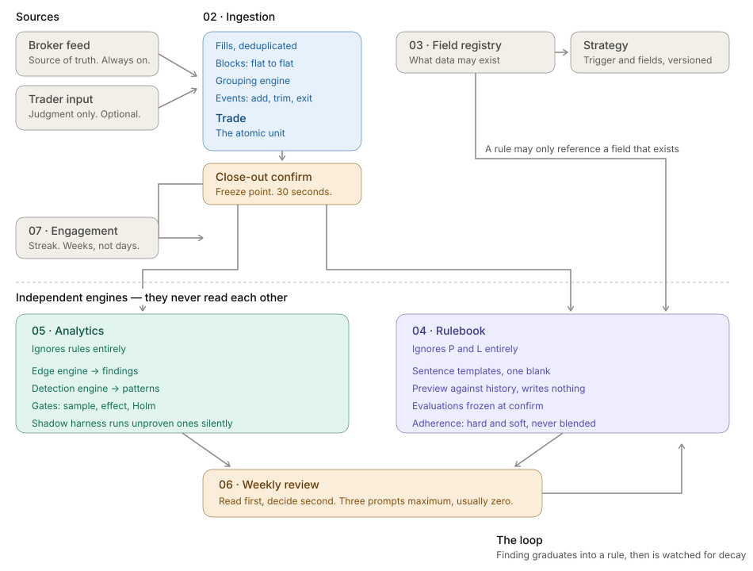
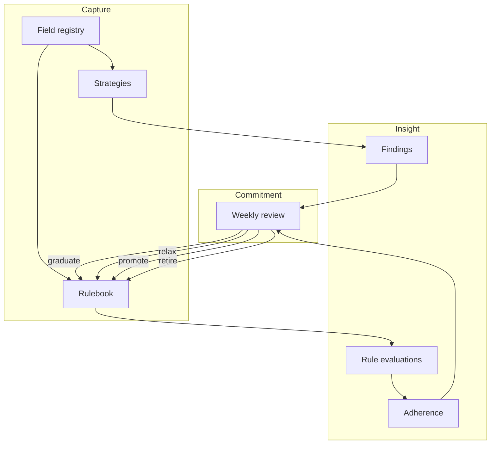
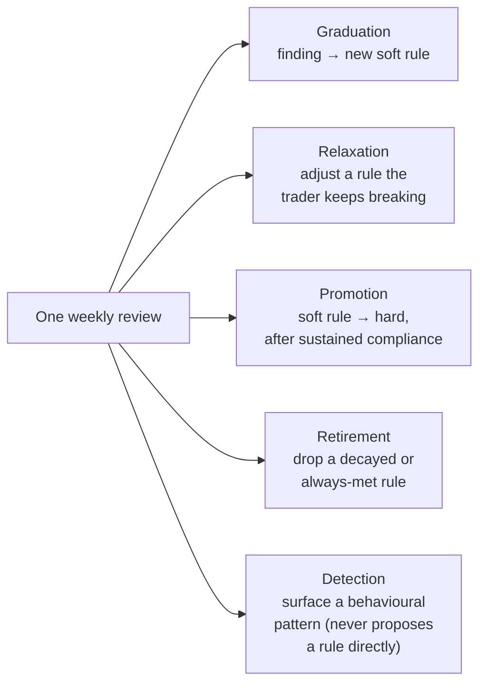

# Product and domain

The vocabulary here is coined, dense, and used precisely everywhere else in
this handbook and in the code. Read this file before `03-architecture.md`
or `05-data-access.md` — they assume it. If a term here is unfamiliar
later, `15-glossary.md` has it alphabetically with a code pointer.

## The question, and the one it refuses to ask

Retrospeq asks **"was this a good decision?"**, never **"did this trade
make money?"**. Those two questions produce different products. A
currency P&L number rewards outcome, and outcome is partly luck — a
badly-sized trade that happens to work is a good outcome and a bad
decision, and a well-sized trade that hits its stop is the reverse. A
product that leads with P&L trains the trader to read the wrong signal.

The home screen has no currency P&L anywhere on it, by design (not an
oversight — `retrospeq-design-system/modules/08-onboarding-and-home.md`
§7.2, and see "Non-negotiables" below). Where a monetary result matters,
it's expressed as an **R-multiple** (realised P&L divided by the amount
of account equity actually put at risk), which is decision-relative:
risking 1% and making 2% back is `+2R` regardless of the account's
currency or size. Currency P&L still exists — it lives one tab away, in
Performance, entered deliberately rather than surfacing by default.

## The three objects

Everything in the product is one of three things:

- **Field registry** (one per trader) — the shared vocabulary. A handful
  of permanent *derived* fields every account gets for free (things the
  system can compute from broker data alone, like `drv.direction` or
  `drv.session`) plus whatever custom fields a trader defines and
  captures by hand (a rating, a note, a pick-one). Strategy and Rulebook
  are both built on top of this registry — neither can reference a field
  that doesn't exist in it. Spec: `03-field-registry-and-strategy.md`.
- **Strategy** (many per trader) — a named way of trading, with its own
  captured fields and trigger conditions, that produces **Findings**:
  statistical facts about how that strategy actually performs, surfaced
  only once the data honestly supports them. Spec:
  `03-field-registry-and-strategy.md` (definition) and
  `05-analytics-and-findings.md` (what it produces).
- **Rulebook** (one per trader) — the constraints a trader has written
  for themselves, evaluated automatically against every trade, producing
  **Adherence**: did they follow their own rules. Spec:
  `04-rulebook-and-evaluation.md`.

The discriminator for which bucket something belongs in, verbatim from
`AGENTS.md`:

> **Can it be violated? → Rulebook. A fact → Strategy.**

"Never risk more than 1% per trade" can be violated — Rulebook. "Trades
tagged Conviction 4–5 win 71% of the time" is a fact about what
happened, nobody violated it — Strategy. This test resolves almost every
ambiguous case; when a feature spec seems to want both, that's a sign it
should be split into two things, not modelled as one.

## Finding vs. Rule — different objects, different lifecycles

A **Finding** is an *observation*. It's produced by the analytics engine
running statistical gates (sample size, effect size, significance —
`05-analytics-and-findings.md` §4.3) over a trader's own closed trades,
segmented by a field. It can be `confident`, `provisional`,
`insufficient` (not enough data — a correct, common state, not a bug),
or `null_result` (the gates ran and found no real difference, which is
itself useful information, not silence). A finding's lifecycle is
**statistical**: it's recomputed as new trades arrive, and once
superseded, the old value is kept only as history.

A **Rule** is a *constraint*, always authored (by the trader directly,
or accepted from a finding via graduation — see below), and always
starts `soft`. Its lifecycle is **evaluative, not statistical**: every
trade is checked against the rule version that was live when the trade
was opened, the result is `followed`, `broken`, or `not_applicable`, and
that result is **frozen** at close-out confirmation — it never changes
again, even if the rule is later edited or deleted. A finding describes
the past and keeps being recomputed; a rule's evaluations are decided
once and locked, because adherence has to mean the same thing in six
months that it means today.

They stay genuinely separate engines. The analytics engine never imports
rule code, and the rulebook engine never imports analytics code — an
ESLint rule and `dependency-cruiser` enforce this at build time, not
just by convention (`AGENTS.md` non-negotiables;
`docs/adr/` has the specific boundary decisions).

## The closed loop

```
Trade happens → Analytics engine produces a Finding
                 Rulebook engine produces an Evaluation, frozen at close-out
                              │                    │
                              ▼                    ▼
                    Adherence accrues       Decay checks watch
                    (hard / soft,           graduated rules for
                    never blended)          fading edges
                              │                    │
                              └────────┬───────────┘
                                       ▼
                              Weekly review (read, then decide)
                                       │
                    ┌──────────┬───────┼───────┬───────────┐
                    ▼          ▼       ▼       ▼           ▼
               Graduation  Relaxation Promotion Retirement Detection
              (finding →  (loosen a  (soft →   (drop a    (surface a
               new rule)   drifting   hard,     decayed or  behavioural
                           rule)      earn      always-met  pattern —
                                      trust)     rule)       never propose
                                                              a rule from
                                                              this alone)
```

Every decision the trader can make in a weekly review feeds back into
the Rulebook (a new or changed rule version) or closes something out
(retirement). Nothing loops back into the analytics engine directly —
findings are recomputed from trade data on their own schedule, not from
review decisions. The five decision families are the *only* place rules
change outside direct manual editing, which is what keeps "why does my
rulebook look like this" always traceable to either the trader's own
hand or one of these five named events.

## Non-negotiables, and what each one protects

These are enforced in code or by review, not just documented — see
`AGENTS.md` for the canonical list and each ADR for the reasoning behind
a specific one.

| Non-negotiable | What it protects |
|---|---|
| Rule evaluations freeze at close-out, never recomputed | Adherence has to mean the same thing looking back six months as it meant the day it was recorded — regrouping a trade or editing a rule later must not silently rewrite history someone already saw and acted on. |
| No compound rules (AND/OR) anywhere | Two separate soft rules read clearly, evaluate independently, and attribute a break to exactly one named rule. A compound rule can be satisfied by a coincidence of two unrelated conditions and can't tell a trader which half of their own logic actually held. |
| Adherence earns no XP | The moment following a rule pays out points, a trader is incentivised to write rules they never intend to test themselves against, and to stop logging the breaks that make adherence honest (`docs/adr/0044`). |
| Streaks count weeks, not days | A daily streak rewards trading every day, which is exactly the overtrading behaviour the product elsewhere tries to detect (`seq.trades_per_day`). Some days the right decision is to sit out — that has to be able to keep a streak intact. |
| One notification per week, total | The entire engagement surface is spent on the one moment (the weekly review) that actually converges findings and adherence into a decision — spending it on anything more frequent trains the trader to ignore notifications from this product specifically. |
| "Not enough data yet" is a correct state, not a bug | A finding surfaced on eleven trades is worse than no finding — false confidence is the thing an honest journal exists to avoid. Saying nothing, plainly, is what makes the findings that do appear later credible. |
| No red/green anywhere; direction is geometry | Colour-coding win/loss trains the same P&L-first reflex the product is built to break. Direction (up/down, more/less) is shown structurally — position, sign, an arrow — never by hue, and there are no success/danger design tokens to reach for even by accident. |
| Price proximity is banned from trade grouping | Averaging down into a loser is, by definition, an add at a distant price. A grouping engine that used price closeness as a signal would systematically fail to detect `added_to_a_loser` — one of the most behaviourally revealing facts the product can surface — exactly when it happens (`00-foundation.md` §9.2, `02-trade-ingestion-and-model.md` §4.3). |

## Navigating the spec

The authoritative product spec is `retrospeq-design-system/modules/` —
dense, and organised by module rather than by question. This table maps
a question to the file and section that answers it, so you don't have to
read all of it to answer one thing.

| Question | Module file | Section |
|---|---|---|
| What's cross-cutting (security, privacy, RLS, error taxonomy, testing bar)? | `00-foundation.md` | Whole file — every other module inherits it |
| Why R-multiples and not currency? What's `risk_pct` peak-vs-initial? | `02-trade-ingestion-and-model.md` | §4.4 Derived trade facts |
| How does a scaled-in position become one trade, not three? | `02-trade-ingestion-and-model.md` | §4.2–4.3 Block derivation, the grouping engine |
| What's a field, and when can a trader add one? | `03-field-registry-and-strategy.md` | §4.2–4.5 |
| How is a rule threshold picked, and why can it only get stricter? | `04-rulebook-and-evaluation.md` | §5.1–5.2 Authoring pipeline, validation |
| Why can't the rule engine be SQL or `eval`? | `00-foundation.md`, `04-rulebook-and-evaluation.md` | §4.3; §5.3 |
| How does a finding get statistically gated? | `05-analytics-and-findings.md` | §4.2–4.3 Edge engine, statistical gates |
| What's a detection versus a finding? | `05-analytics-and-findings.md` | §4.4 |
| How does the weekly review pick which prompts to show? | `06-review-and-graduation.md` | §4.3–4.5 |
| Why does the streak count weeks, and what's the grace week? | `07-engagement.md` | §3 |
| What does a brand-new account see, in what order? | `08-onboarding-and-home.md` | §5–7 |
| Every finding/detection id, its plan gate, its statistical config | `analytics-registry.md` | Whole file |
| Where a spec convention was deliberately not followed, and why | `docs/adr/NNNN-*.md` | One decision per file |

## Diagrams



`retrospeq-design-system/modules/retrospeq_whole_application_flow.svg` is
a hand-drawn diagram of the whole system that predates this handbook and
was, until now, linked from nothing in the repo. It's worth opening
directly (most Markdown viewers and GitHub render SVGs inline) — it
traces the same fill → block → trade → close-out pipeline as
`02-trade-ingestion-and-model.md`, then shows the **two independent
engines** side by side: Module 05 Analytics ("ignores rules entirely")
and Module 04 Rulebook ("ignores P and L entirely"), each computing from
the same trade data without reading the other's output. Both feed into
**Module 06 Weekly review** — "read first, decide second" — which is the
convergence point: the one place in the product where a finding and a
rule can affect each other, via graduation.





## Last refreshed

2026-09-18, documentation slice 2b — written against the module specs
(`retrospeq-design-system/modules/00`, `02`–`08`), `AGENTS.md`'s
non-negotiables, and the code in `lib/rules/`, `lib/analytics/`,
`lib/review/` as they exist today. If a non-negotiable's enforcement
mechanism changes (e.g. the ESLint/dependency-cruiser boundary), update
this file's "different engines" claim in the same change.
