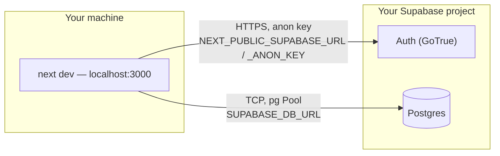
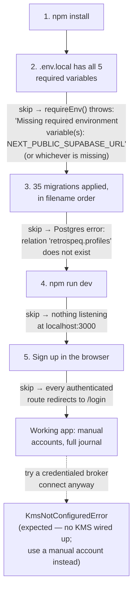

# Getting started

Everything needed to get a fresh clone running locally, make one real
change, and verify it — for a human or an agent who has never opened this
repo before. Product/domain background lives in `docs/handbook/01-*`
(not yet written — see `docs/README.md`); this file is hands-on only.

## Prerequisites

- macOS or Linux. (The project moved off Windows 2026-09-13; any
  `C:`/`E:`-drive workaround you find in `docs/ledger/` is obsolete.)
- **Node 24.** `vitest` is pinned to `3.2.7` in `package.json` — don't
  "fix" that without reading its comment first.
- A Supabase project (any tier — the free tier is what this project
  itself runs on, `docs/adr/0045`). You need its project URL, its keys,
  and its direct Postgres connection string. Creating one is a Supabase
  dashboard task, not something this repo automates.
- Playwright's browser binaries, if you'll run E2E tests:
  `npx playwright install chromium`.

## What talks to what, locally



Only the second path — a direct `pg` connection over `SUPABASE_DB_URL` —
carries any domain data (trades, rules, findings, accounts, everything
under the `retrospeq` schema). The Auth path only ever handles session
cookies and tokens; see `docs/handbook/03-architecture.md` (not yet
written) or `docs/DEVELOPMENT.md`'s "Direct Postgres access" section for
why `.from()`/`.rpc()` can't reach the domain data at all.

## Environment variables

Copy `.env.local.example` to `.env.local` and fill in real values — never
commit `.env.local`, never paste a real value into a doc or a commit
message.

| Variable | Required? | What it's for | What breaks without it |
|---|---|---|---|
| `NEXT_PUBLIC_SUPABASE_URL` | **Required** | Supabase project URL, read by the browser and server Auth clients (`lib/supabase/client.ts`/`server.ts`) — Auth only, not domain data. | `requireEnv()` throws `Missing required environment variable(s): NEXT_PUBLIC_SUPABASE_URL` the first time any page renders. |
| `NEXT_PUBLIC_SUPABASE_ANON_KEY` | **Required** | Anon key paired with the URL above. | Same throw, naming this var instead. |
| `SUPABASE_URL` | **Required** | Same project URL, read server-side only by the service-role client (`lib/supabase/service.ts`) — privileged/background work that bypasses RLS. Kept separate from `NEXT_PUBLIC_SUPABASE_URL` so nothing server-only leaks into the browser bundle; in practice it's the same URL, just without the `NEXT_PUBLIC_` prefix. | Any privacy/entitlement/background code path throws the same `requireEnv` error. |
| `SUPABASE_SERVICE_ROLE_KEY` | **Required** | Legacy Supabase `service_role` key, paired with `SUPABASE_URL`. | Same throw as above. |
| `SUPABASE_DB_URL` | **Required** | Direct Postgres connection string (`lib/supabase/direct.ts`) — every read/write to the `retrospeq` schema goes through this, plus the rate limiter and `scripts/test-user.mjs`. Use the **session pooler** connection string from the project's Database Settings, not the direct/IPv6 host — the direct host has hung for 15+ minutes in practice (`lib/supabase/direct.ts`'s own header comment). | `requireEnv(['SUPABASE_DB_URL'])` throws the moment any trade/rule/finding/account code runs — i.e. almost everything past the login screen. |
| `RETROSPEQ_KMS_KEY_ID` | Optional, currently non-functional | Reference to an external KMS master key for broker-credential envelope encryption. | No observable difference either way — no real KMS exists yet, so `createKmsMasterKeyProvider()` throws `KmsNotConfiguredError` regardless (`docs/infra-gaps.md`). |
| `RETROSPEQ_ENABLE_DEV_ENTITLEMENT_TOOLS` | Optional | Gates a dev-only tool (`lib/entitlements/dev-tools-guard.ts`) that flips a test user's plan without a real billing provider. | That dev tool refuses to run. |
| `RETROSPEQ_ENABLE_DEV_PRIVACY_TOOLS` | Optional | Sibling flag (`lib/privacy/dev-tools-guard.ts`) gating dev-only privacy/erasure test tooling; several `lib/privacy/__tests__/*.live.test.ts` files set it themselves for the duration of one test. | Dev-only privacy tools refuse to run outside tests that set the flag themselves. |
| `RETROSPEQ_E2E_RATE_LIMIT_BYPASS` | Optional | Fail-closed, dev/test-only rate-limit bypass (`docs/adr/0042`) for the E2E suite. `playwright.config.ts` sets it automatically for the server it starts. | If you run `next dev` yourself and then point Playwright at it, the E2E suite trips the real sign-in rate limit partway through — export this yourself in that shell. |
| `RESEND_API_KEY` | Optional, required with `EMAIL_FROM` for real app-authored email | Transactional email (`lib/privacy/email-provider.ts`) — e.g. the erasure confirmation email. **Not** the same thing as Supabase Auth's own mailer (signup/reset emails work independently, via Resend SMTP configured on the Supabase project itself). | `getTransactionalEmailProvider()` throws `EmailProviderNotConfiguredError` — never a silent "pretend it sent" no-op. |
| `EMAIL_FROM` | Optional, paired with `RESEND_API_KEY` | Verified "From" address; the sender domain must be verified in the Resend dashboard. | Same throw as above if either is missing or invalid. |
| `EMAIL_FROM_NAME` | Optional | Display name for the From header. | Defaults to `"Retrospeq"`. |

**Legacy vs new Supabase key pairs:** Supabase now issues two parallel
sets of API keys for the same project — the legacy pair
(`anon`/`service_role`, what `NEXT_PUBLIC_SUPABASE_ANON_KEY` and
`SUPABASE_SERVICE_ROLE_KEY` above are) and a newer pair
(`publishable`/`secret`, plus a `SUPABASE_JWKS_URL` for verifying tokens
against the new key format). This codebase's Supabase clients
(`lib/supabase/client.ts`, `server.ts`, `service.ts`) only read the
**legacy** pair today — if your Supabase dashboard only shows you the new
publishable/secret keys, use those values but still assign them to the
legacy-named variables above (`NEXT_PUBLIC_SUPABASE_ANON_KEY` /
`SUPABASE_SERVICE_ROLE_KEY`). Don't add `SUPABASE_PUBLISHABLE_KEY` /
`SUPABASE_SECRET_KEY` / `SUPABASE_JWKS_URL` expecting them to do
anything — no code reads them yet.

**Not required for local development** (deployment- or test-runner
concerns, not app config): `CRON_SECRET` (only used by the deployed
Vercel Cron job, `app/api/cron/weekly-review/route.ts`), `APP_BASE_URL`
(defaults to `http://localhost:3000`), `E2E_BASE_URL` (Playwright's own
base URL override, defaults the same way), `NODE_ENV` (set by the tooling
that runs your command, not something you set by hand).

## Applying migrations

`supabase/migrations/` holds 35 SQL files, meant to be applied **in
filename (timestamp) order** — there's no `supabase db push` wired into
an npm script, and this checkout has no `supabase/config.toml` (only
`migrations/` is tracked), so you apply them straight against your
project with the Supabase CLI:

```bash
npx supabase db push --dry-run --db-url "$SUPABASE_DB_URL"   # preview first
npx supabase db push --db-url "$SUPABASE_DB_URL"              # applies them
```

**Gotcha:** the second command lists the pending migrations and waits for
a `y`/`N` confirmation on stdin. If you (or an agent) run it from a
context with no attached terminal — piped, backgrounded, or through a
tool that doesn't give it a TTY — it just **hangs** waiting for input
that will never come, until whatever's watching the process kills it.
Run it from an interactive shell yourself, or pre-answer it:

```bash
yes | npx supabase db push --db-url "$SUPABASE_DB_URL"
```

(Only do the `yes |` form after you've looked at the `--dry-run` output —
it blindly confirms whatever the CLI is about to do.)

## Running the dev server

```bash
npm run dev
```

Opens on `http://localhost:3000`. `next.config.ts` caps build workers at
2 (`experimental.cpus`) — a known-good workaround for an OOM crash on a
resource-constrained host; `npm run dev` itself is unaffected.

## Setup as a gated checklist



## Creating a test user

```bash
npm run test:user -- create my-label      # prints {id, email, password} JSON
npm run test:user -- delete <id-or-email> # clean up one
npm run test:user -- cleanup              # deletes this repo's test-pattern
                                           # users created in the last 6h
```

Always clean up throwaway accounts you create — `cleanup` matches only
this repo's own test-email patterns (`@example.com`, `@example.test`,
etc.), never a real address.

## What works on a fresh clone, and what doesn't

**Works end-to-end**, no extra setup beyond the above: signing up,
onboarding, manual (no-credential) trading accounts, manual trade entry,
the whole journal — grouping, rulebook, adherence, findings, weekly
review, engagement. This is most of the product.

**Cannot work without infrastructure this repo doesn't have**:
connecting a real broker account with credentials. There's no external
KMS wired up, so envelope-encrypting a broker credential always throws
`KmsNotConfiguredError` — this is the correct, honest failure mode
(`AGENTS.md` → "Never fake it, always flag it"), not a bug to work
around. See `docs/infra-gaps.md` for the full standing-gaps list.

## Making your first change

1. Pick something small and real — a copy fix, a missing test case, a
   one-file bug fix.
2. `npm run classify` — tells you the risk tier your change lands in
   (0-3) and why, from the files you've touched. Higher tiers need more
   review; see `AGENTS.md` → "How work flows" for the tier table.
3. Make the change.
4. `npm run verify` — runs exactly the checks your tier needs, scoped to
   the directories you touched (not the whole repo). This is the same
   command a coding agent runs before committing.
5. If you touched a route with an E2E spec: `npm run e2e:changed`.
6. Commit. (`.githooks/pre-commit` runs a ledger-length check plus
   `eslint` on staged files regardless of tier.)

For anything bigger, `docs/handbook/14-making-a-change.md` (not yet
written — see `docs/README.md`) will eventually walk through a full
worked example; until then, `docs/process.md` explains the same tiered
pipeline in more depth.

## Troubleshooting

| Symptom | Cause | Fix |
|---|---|---|
| `PGRST205` / `PGRST106` / "schema not exposed" / "Invalid schema: retrospeq" | You called `.from(...)` or `.rpc(...)` against a Supabase client — the `retrospeq` schema isn't exposed to PostgREST. | Use `lib/supabase/direct.ts`'s `withUserConnection`/`withServiceRoleConnection` instead. See `docs/adr/0006`. |
| `KmsNotConfiguredError` on a broker connect | Expected — no external KMS is wired up (`docs/infra-gaps.md`). | Use a manual (no-credential) account instead; this isn't something to "fix" locally. |
| `supabase db push` hangs forever | It's waiting for a `y`/`N` confirmation on stdin your shell/tool never provides. | Run it from an interactive terminal, or pipe `yes` into it after reviewing `--dry-run` first. |
| A live test fails with "Hook timed out in \[...\]" | A `beforeEach`/`afterEach` in a `*.live.test.ts` file did real Postgres work (sometimes an unscoped sweep like `autoConfirmStaleTrades`) that took longer than Vitest's default hook timeout — see `docs/runbook.md`'s "`autoConfirmStaleTrades` sweep duration" entry. | Re-run that one test file in isolation before assuming your change caused it; if it's consistently slow, that's a `docs/runbook.md` operational condition, not a code bug to chase. |
| Dashboard/home screen looks empty, no error | This is the correct "not enough data yet" state (`AGENTS.md` non-negotiables) — Retrospeq refuses to show a finding or adherence figure the data doesn't honestly support yet. | Not a bug. Create a few trades (manual entry) and close some days out to see the other dashboard states. |
| `EmailProviderNotConfiguredError` | `RESEND_API_KEY`/`EMAIL_FROM` missing or invalid — a deliberate loud failure, never a fake "sent" success. | Set both in `.env.local` if you need to exercise app-authored email locally; otherwise ignore it outside that one code path. |
| `npm run build` OOMs | Too many parallel workers for available RAM during "Collecting page data." | Already capped via `next.config.ts`'s `experimental.cpus: 2`; if it still OOMs, check for leftover `node`/dev-server processes before assuming a regression. |
