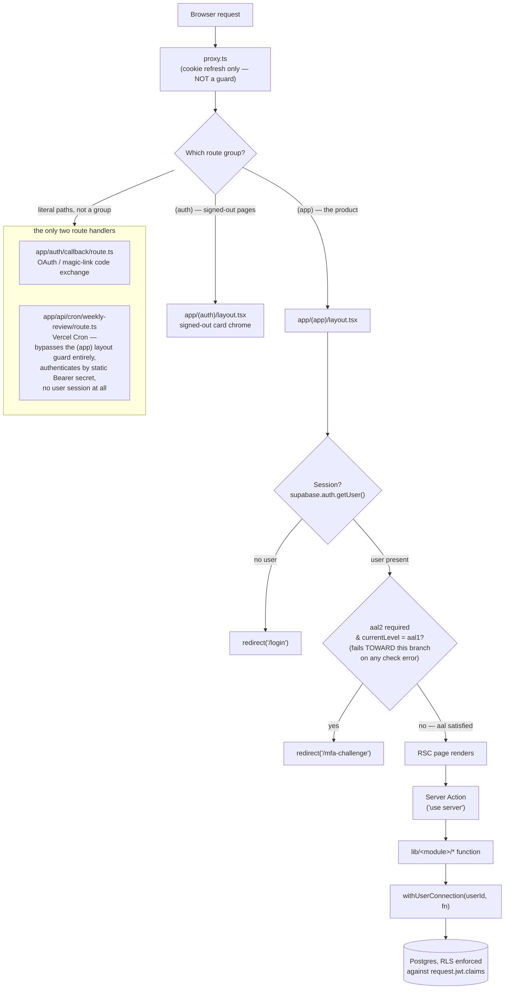
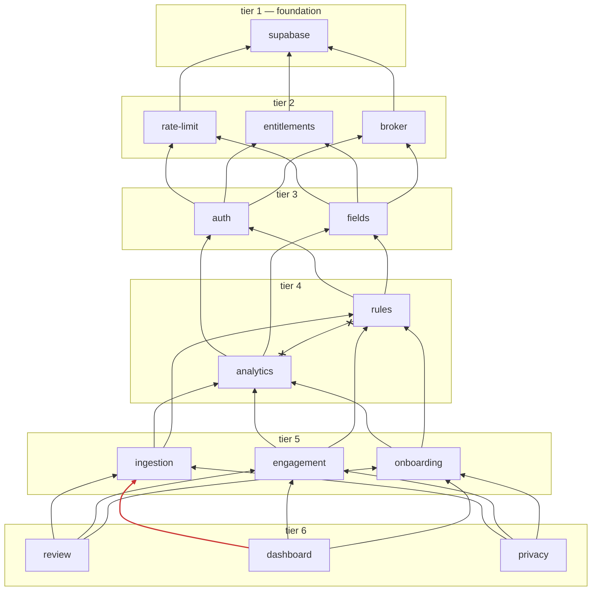

# Architecture

Retrospeq is a Next.js App Router app where **the database is the domain
boundary, not a service layer**: there is no ORM, no repository
framework, and no internal API — a Server Action calls a plain function
in `lib/<module>/`, that function runs SQL against a real Postgres
connection with Row Level Security doing the actual authorization work,
and the result flows straight back into a React Server Component. The
module boundaries that matter (Module 04 vs. Module 05, in particular)
are enforced by static tooling against the file tree, not by process or
network isolation.

This file covers the request path, the Server Action contract, module
layering, the one boundary that's mechanically enforced, and the
rendering model. For *why* domain data goes through a direct Postgres
connection instead of `.from()`/`.rpc()`, see
`docs/handbook/05-data-access.md` — that's the highest-leverage
misunderstanding this file can set you up to avoid, so it gets its own
page.

## Where the auth guard actually is

**`proxy.ts` (repo root) is not a guard.** It is Next 16's renamed
`middleware.ts` convention (see the file's own header comment for the
exact doc citation) and its only job is refreshing the Supabase session
cookie on every request via `supabase.auth.getUser()` — required so a
Server Component can pick up a rotated refresh token instead of silently
working with a stale one. If Supabase isn't configured
(`NEXT_PUBLIC_SUPABASE_URL`/`_ANON_KEY` missing), it fails **open**
deliberately — an unconfigured project must not turn every route into a
500 before the app can render its own "not configured" state.

The real guard is `app/(app)/layout.tsx`, wrapping every route under the
`(app)` route group. It does two checks, in order, and **fails toward
the gate** on any ambiguity:

1. **Session.** `supabase.auth.getUser()` — no user, `redirect('/login')`.
2. **aal2 step-up.** `supabase.auth.mfa.getAuthenticatorAssuranceLevel()`
   — if the check itself errors, redirect to `/mfa-challenge` anyway
   (logged as a warning, never treated as "let them through"); if the
   session needs `aal2` and is still at `aal1`, same redirect.

The aal2 check exists here — not just as a UX nudge on the sign-in
redirect in `app/(auth)/actions.ts` — because of a real, since-fixed gap:
`signInWithPassword()` issues a valid, cookie-backed `aal1` session
*before* any TOTP challenge, so a client already holding those cookies
(or one that called `signInWithPassword` directly, bypassing the login
form's own post-submit redirect) could reach every route in the group,
including `/accounts/connect` — a real `account_credentials` write —
without ever completing the second factor. `retrospeq-security-reviewer`
flagged this as a blocking FAIL against the auth slice; the fix was
moving the enforcement to where the protected resource is actually
served. **Assuming `proxy.ts` guards the app is the specific mistake
that shipped an unauthenticated page once already** — don't repeat it by
adding a new protected surface outside the `(app)` group without its own
equivalent check, or by trusting a redirect earlier in a flow as if it
were an enforcement boundary.



## Server Actions, not routes

Every mutation and most reads happen through a `'use server'` file
named `actions.ts`, colocated with the route that calls it (one per
route segment that needs one, plus `app/(auth)/mfa-challenge/actions.ts`
and `app/(auth)/mfa-challenge/recovery/actions.ts` for the two-step MFA
flow, and `app/(app)/review/decisions/actions.ts` /
`app/(app)/review/month/actions.ts` for the review sub-pages). None of
them are `fetch`ed — they're called as plain async functions from a
Client or Server Component and Next.js handles the RPC wiring.

**The contract every action honours**, reconstructed from the real
implementations (`app/(app)/rules/actions.ts`, `app/(app)/accounts/
actions.ts`, `app/(app)/trades/actions.ts` are the clearest examples —
each has its own header comment walking through its own pipeline in
order):

1. **Session + rate limit.** `supabase.auth.getUser()` for the caller's
   id, then `enforceRateLimit(scope, ip, userId)`
   (`lib/rate-limit/limiter.ts`) — usually one combined early-return
   helper per file (e.g. `requireSessionAndRateLimit` in
   `rules/actions.ts`), checked *before* the input is parsed.
2. **`.strict()` Zod parse of the input.** Every input schema uses
   `z.strictObject(...)` (or `.strict()`), never a bare `z.object(...)`
   — a plain object schema silently strips unknown keys in this repo's
   Zod version (v4.4.3) instead of rejecting the payload, which
   `retrospeq-security-reviewer` confirmed live (00-foundation §4.2,
   "reject unknown keys"). `rules/actions.ts`'s `createRuleInputSchema`
   deliberately **omits** an `origin` field from its public contract for
   this reason — see `docs/adr/0040` decision 7.
3. **Entitlement check.** `canForUser(userId, '<capability>')`
   (`lib/entitlements/service.ts`) — e.g. `rules.create`'s 3-rule Free
   cap. Some actions skip re-running this on an edit path (`editRule`
   doesn't re-check `rules.create` — a threshold change consumes no new
   slot), a documented exception, not an oversight.
4. **Ownership check.** A fetch scoped to `user_id = $1` before any
   write — belt-and-suspenders on top of RLS, not a substitute for it:
   the repository query below still runs under `withUserConnection`, so
   a caller past the application-layer check still hits real RLS.
5. **Connection helper.** The repository function (in
   `lib/<module>/*-repository.ts`) wraps its query in
   `withUserConnection` (or, on the documented allowlist,
   `withServiceRoleConnection`) — see `docs/handbook/05-data-access.md`.
6. **`revalidatePath(...)`** for whichever route just changed, once the
   write commits. Read-only actions (e.g. `preview()` in
   `lib/rules/preview.ts`) skip this deliberately.

Typed errors, not thrown exceptions, cross the Server Action boundary
for anything a UI needs to react to (`RuleActionState`'s `{ error: {
code, user_message, retryable } }` shape, `ActionErrorState` variants
elsewhere) — an unrecognised error class is re-thrown rather than
laundered into a generic message, per AGENTS.md's "never fake it"
applied to error handling (see `rules/actions.ts`'s
`structuralValidationErrorState` for the pattern: every named error
class gets a mapped user-facing message, anything else `throw`s).

```mermaid
sequenceDiagram
  participant U as Browser (form)
  participant A as Server Action
  participant Z as Zod .strict()
  participant RL as Rate limiter
  participant E as Entitlement check
  participant O as Ownership check
  participant C as withUserConnection
  participant DB as Postgres (RLS)

  U->>A: call action(input)
  A->>RL: enforceRateLimit(scope, ip, userId)
  alt over limit
    RL-->>A: RateLimitExceededError
    A-->>U: { error: RATE_LIMITED, retryable: true }
  else within limit
    A->>Z: schema.safeParse(input)
    alt parse fails / unknown key
      Z-->>A: issues[]
      A-->>U: { fieldErrors }
    else parse succeeds
      A->>E: canForUser(userId, capability)
      alt not entitled
        E-->>A: false
        A-->>U: { error: PLAN_LIMIT, retryable: false }
      else entitled
        A->>O: fetch scoped to user_id = $1
        alt not owned / not found
          O-->>A: null
          A-->>U: { error: NOT_FOUND, retryable: false }
        else owned
          A->>C: withUserConnection(userId, fn)
          C->>DB: BEGIN; SET LOCAL ROLE authenticated;\nset_config(request.jwt.claims); ...write...; COMMIT
          DB-->>C: row(s)
          C-->>A: result
          A->>A: revalidatePath('/route')
          A-->>U: { success: true, ... }
        end
      end
    end
  end
```

### The only two route handlers

Everything else is a Server Action; exactly two things in this repo are
real `route.ts` files, and each exists for a reason a Server Action
structurally cannot satisfy:

- **`app/auth/callback/route.ts`** — the single exchange point for every
  Supabase Auth redirect that hands back a PKCE `code`: Google OAuth,
  email-confirmation links, and password-reset links. It has to be a
  real, stable URL a third party (Google, Supabase's own mailer)
  redirects a browser to — a Server Action has no such stable, directly
  navigable URL, and a route group's parens aren't part of the URL
  either (`(auth)/callback` would still resolve to `/callback`, not
  `/auth/callback`, so it lives outside the group entirely). It reads
  the caller's IP straight off `request.headers` (no `next/headers`
  helper exists for a plain Route Handler) to rate-limit the exchange,
  then treats the `next` redirect target as attacker-influenceable input
  — only a same-origin relative path is honoured, anything else falls
  back to `/`.
- **`app/api/cron/weekly-review/route.ts`** — the Module 06 weekly
  notification job, triggered by Vercel Cron (`vercel.json`'s `crons`
  entry), which needs a URL Vercel's scheduler can hit on its own
  schedule with no browser and no user session involved at all. It
  **deliberately bypasses the `(app)` layout guard entirely** — there is
  no session to check, because the job runs once for every trader in one
  process, using the service-role path inside `lib/review/weekly-job.ts`
  rather than any single user's identity. Authentication is a static
  `Authorization: Bearer <CRON_SECRET>` header, compared in constant
  time; if `CRON_SECRET` is unset the handler refuses to run at all
  (503, naming the missing variable) rather than serving an
  unauthenticated endpoint that emails every trader — the same
  "never fake it, always flag it" posture, applied to a scheduler
  auth gate rather than a broker credential.

## Module layering

`lib/` is organised into six tiers. Dependencies point downward only —
a module in a lower tier never imports from a higher one:



*(The `analytics x--x rules` edge above is the forbidden one, labelled
in the next section — Mermaid draws it as a normal edge with no arrow
semantics; treat it as documentation, not a real dependency.)*

There is **one module-level cycle**: `rules` (Module 04) reads trade
outcome data that `ingestion` (Module 02) produces (its rule-evaluation
freeze depends on a confirmed trade existing), while `ingestion`'s own
grouping/confirmation pipeline consults active rules for real-time
guidance. This is **file-level acyclic** — no single `.ts` file imports
a chain that loops back to itself — the cycle exists only at the
module-directory level, which is a normal and accepted shape for two
modules that are genuinely mutually referential by spec (Module 02 and
Module 04 are adjacent build-order items for exactly this reason — see
AGENTS.md's "Build order").

## The enforced boundary: analytics must never reach rules

`lib/analytics` (Module 05, Findings) must never import anything from
`lib/rules` (Module 04, Rulebook), directly or transitively. **Why**: a
finding has to be derivable from trade outcomes alone — the moment the
edge/detection engine can see what the trader *committed to* (an active
rule, an adherence score), a finding stops being an independent
observation and starts being contaminated by the trader's own
self-assessment. Module 05 §7.5, verbatim: "If the edge engine can see
adherence, findings become uninterpretable." AGENTS.md restates this
module-agnostically as a non-negotiable. The full history of *how* this
got enforced — including two real bypasses found and closed the same
day, and one accepted residual gap — is `docs/adr/0021`.

Three independent mechanisms enforce it today, deliberately redundant
because no single one is airtight on its own:

1. **ESLint**, scoped to `lib/analytics/**` in `eslint.config.mjs`:
   - `no-restricted-imports` with a regex pattern
     (`^(@/lib/rules(/.*)?|(\.\./)+rules(/.*)?)$`), depth-agnostic for
     relative imports.
   - Two `no-restricted-syntax` selectors, because
     `no-restricted-imports` only ever inspects static `import`
     declarations, never a dynamic `import()` call (`ImportExpression`
     nodes) — one selector matches a plain string literal specifier, a
     second matches a template literal with zero `${...}`
     interpolations (a quasi-only backtick string, which has no
     `.value` property for the first selector to read).
2. **`dependency-cruiser`**, run via `npm run check:import-boundaries`
   (`.dependency-cruiser.cjs`, scoped to `lib/analytics`), which does
   real module-graph resolution — the same resolution `tsc` does,
   including this repo's `@/*` path alias — rather than pattern-matching
   literal specifier strings. This is what closes the one gap ESLint
   structurally cannot: a file under `lib/analytics/**` importing a
   *re-export* of `lib/rules/**` code from a third file outside that
   tree. `docs/adr/0021` originally deferred adding this tool (citing a
   then-open infra risk around `npm install`); it has since been added —
   trust the presence of `.dependency-cruiser.cjs` and the
   `check:import-boundaries` script over that ADR's own "not currently a
   dependency" sentence, which predates it.
3. **`lib/analytics/__tests__/eslint-boundary.test.ts`** — writes
   throwaway fixture files into a real location under `lib/analytics/`
   (absolute import, relative import at several depths, both dynamic
   `import()` shapes) immediately before each assertion, runs ESLint's
   own Node API against them, asserts the expected rule fires, then
   deletes the fixture in a `finally` (plus an `afterAll` sweep as a
   second safety net) — so this is a real, repeatable proof the rule
   fires, not just a config that looks right by inspection. It also
   contains a **canary test for the one still-open residual risk**
   `dependency-cruiser` doesn't fully close either (a
   substitution-bearing template literal / runtime-constructed dynamic
   import specifier — no static tool can resolve that without dataflow
   analysis) — that canary is *expected* to keep passing, documenting
   the gap rather than hiding it.

`npm run check:security` runs all three (`eslint-boundary` test,
`check:import-boundaries`, plus the rest of the security suite) as one
bundle; `npm run check` runs the ESLint half via its own `eslint .` step
regardless of which files you touched.

## Rendering model

React Server Components by default — every `page.tsx` under `app/(app)/`
and `app/(auth)/` is a Server Component unless it opens with `'use
client'`. A component earns `'use client'` for one of: local UI state
(a stepper, a dot-rating input, an open/closed accordion), a browser-only
API (the OAuth kick-off in a login button), or wiring a Server Action's
result into `useActionState`/`useTransition` for pending/error UI.
Everything else — data fetching, the actual RLS-scoped read, assembling
props — stays server-side; there is no client-side data-fetching layer
(no SWR/React Query, no client-side cache) anywhere in this repo.

## What is deliberately absent

- **No ORM.** Every query in `lib/*/*-repository.ts` is hand-written SQL
  against a `pg` client — the schema and its RLS policies are the actual
  contract, and an ORM would either hide which role a query runs as (the
  property `docs/handbook/05-data-access.md` is built around) or need to
  reimplement that distinction itself.
- **No repository *framework*.** `*-repository.ts` is a naming
  convention for "the functions that touch this module's tables," not a
  shared base class or generated interface.
- **No internal API layer.** A Server Action *is* the API boundary;
  nothing forwards to a separate REST/GraphQL layer.
- **No client-side state manager.** No Redux/Zustand/Jotai — client
  state is local `useState`/`useActionState`, since there is no
  client-side data cache that would need global coordination.

## Where to go next

- Direct Postgres access, the RLS shapes, and the service-role allowlist
  — `docs/handbook/05-data-access.md`.
- The module-by-module product spec each `lib/` directory implements —
  `retrospeq-design-system/modules/0{1-8}-*.md` (source of truth #3-5,
  AGENTS.md).
- Every deliberate deviation from a spec, including the ones named above
  — `docs/adr/`.
- The six-subagent build process this architecture is built under —
  `docs/process.md`.

---

*Last refreshed: 2026-09-18, documentation slice 2a (this file and
`docs/handbook/05-data-access.md` newly written; migrates the
"Architecture overview" ground out of `docs/DEVELOPMENT.md`, which
predates this handbook and should no longer be trusted for this
material).*
