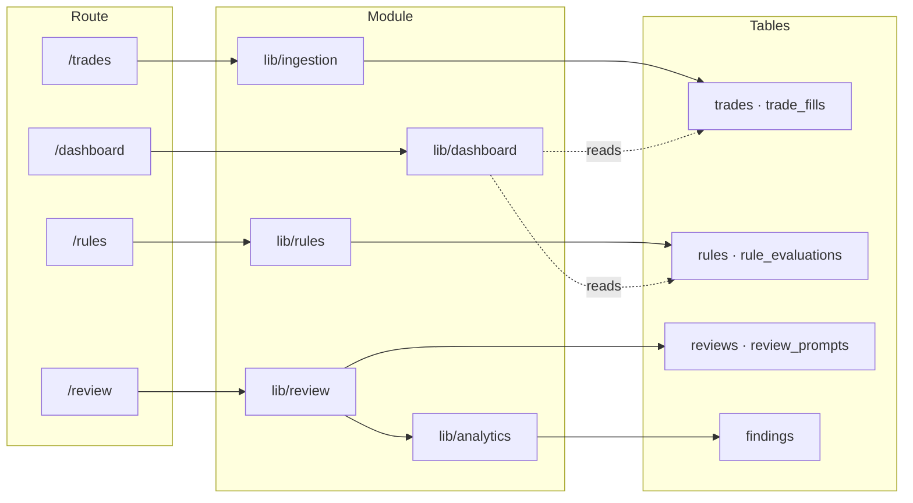

# Module map

Fourteen directories under `lib/`, ordered here by dependency tier rather
than alphabetically — reading top to bottom is reading the layering, and
nothing in a tier may import from a tier below it. The forbidden edge
(`analytics` must never reach `rules`) and the reasoning behind the tiers
are in [Architecture](03-architecture.md).

## Spec module ↔ code

The product spec is organised into Modules 01–08; the code is organised
by domain directory. The mapping is deliberately not one-to-one — Module
01 alone spans four directories — so both lookup directions are here.

| Spec module | `lib/` | `app/` |
|---|---|---|
| 01 Identity & accounts | `auth`, `broker`, `entitlements`, `privacy` | `(auth)/*`, `accounts`, `security`, `privacy`, `plan` |
| 02 Trade ingestion & model | `ingestion` | `trades`, `trades/close-out`, `trades/manual-entry` |
| 03 Field registry & strategy | `fields` | `fields`, `strategies` |
| 04 Rulebook & evaluation | `rules` | `rules`, `rules/new`, `rules/start` |
| 05 Analytics & findings | `analytics` | `strategies/[id]` (render side) |
| 06 Review & graduation | `review` | `review`, `review/decisions`, `review/month` |
| 07 Engagement | `engagement` | surfaced by 06 and 08, no routes of its own |
| 08 Onboarding & home | `onboarding`, `dashboard` | `dashboard`, `onboarding/hook` |
| — (infrastructure) | `supabase`, `rate-limit` | — |

## Tier 1 — foundation

### `lib/supabase`
**Owns** every connection to Postgres, and the auth clients.
**Entry points** `withUserConnection`, `withServiceRoleConnection`,
`createClient`, `createServiceRoleClient`, `requireEnv`.
**Called by** everything.
**Writes** nothing directly — it is the door, not the room.
**Tests** `lib/supabase/__tests__/` — mostly RLS isolation suites plus
the service-role inventory allowlist.
**Read first** [Data access](05-data-access.md), ADR 0003/0005/0006.

## Tier 2 — services with no domain opinions

### `lib/rate-limit`
**Owns** the sliding-window limiter over `rate_limit_hits`, ~55 named
scopes covering every Server Action.
**Entry points** `enforceRateLimit(scope, ip, email?)`, `getClientIp`.
**Note** it deliberately fails *open* on a database error (ADR 0004): an
auth outage caused by the limiter is worse than the abuse it prevents.
The only bypass is `lib/rate-limit/test-bypass.ts`, fail-closed and
dev/test only (ADR 0042).

### `lib/entitlements`
**Owns** plan gating — quantity caps and boolean capabilities.
**Entry points** `canForUser(userId, capability)`, the capability table,
the usage counters.
**Called by** every action that creates something capped, and the pages
that decide whether to offer it.
**Note** gating is always defence in depth: the page checks to render,
the action re-checks to write, and the repository throws its own cap
error underneath.

### `lib/broker`
**Owns** the `BrokerAdapter` contract, the connect flow, credential
envelope encryption.
**Entry points** `connectTradingAccount`, `encryptCredential` /
`decryptCredential`, `insertTradingAccount`.
**Writes** `trading_accounts`, `account_credentials`.
**Note** no vendor type may escape past `BrokerAdapter`. Connect-time
read-only verification has no bypass, and a credential row cannot exist
unless it passed.

## Tier 3 — domain vocabulary

### `lib/auth`
**Owns** auth schemas, error mapping, MFA recovery codes.
**Entry points** `mapAuthError`, `generateRecoveryCodes`,
`redeemRecoveryCode`.
**Note** recovery codes are stored hashed, so they can be shown exactly
once, at generation. A "list my codes" screen is not buildable, by design.

### `lib/fields`
**Owns** the field registry, strategies, strategy versions, trigger
conditions, and the validation for all of them.
**Entry points** `createField`, `fetchFieldsForManagement`,
`validateCapturedValue`, `createTriggerCondition`.
**Writes** `fields`, `strategies`, `strategy_versions`, `field_usages`,
`trigger_conditions`.

## Tier 4 — the two engines

These two never import each other. See the forbidden edge in
[Architecture](03-architecture.md).

### `lib/analytics`
**Owns** the edge engine, detection engine, decay engine, shadow harness,
and the `canRender` gate that decides whether a finding may be shown.
**Entry points** `recomputeEdgeFindingsForUser`,
`recomputeDetectionsForUser`, `runDecayChecksForUser`,
`getStrategyFieldFindings`, `canRender`.
**Writes** `findings`, `detections`, `analytic_renders`,
`finding_rule_links`, `shadow_runs`.
**Never imports** `lib/rules` — a finding must be derivable without
knowing what the trader committed to.

### `lib/rules`
**Owns** the operand catalogue, rule authoring and validation, the
preview engine, frozen evaluation, and adherence.
**Entry points** `evaluateAndFreezeTradeRules`, `evaluate`,
`createRuleInternal`, `preview`,
`recomputeAdherenceWeeklyForConfirmations`, the severity lifecycle.
**Writes** `rules`, `rule_versions`, `rule_evaluations`,
`rule_overrides`, `adherence_weekly`, `operand_distributions`.
**Read first** [Flows — capture](07-flows-capture.md) for the freeze
point, ADR 0016/0022, and ADR 0046 for custom fields as operands.

## Tier 5 — orchestration

### `lib/ingestion`
**Owns** the pipeline from broker fills to confirmed trades: block
derivation, the grouping engine, day close-out, manual entry, split/join.
**Entry points** `runSync`, `confirmDay`, `deriveBlocks`, `groupBlock`,
`computeTradeFacts`, `createManualTrade`, `splitTrade` / `joinTrades`.
**Writes** `fills`, `blocks`, `trades`, `trade_fills`, `trade_events`,
`day_closeouts`, `coverage_gaps`, `sync_runs`.
**Note** price proximity is banned from grouping — it looks like a
missing heuristic and is a non-negotiable.

### `lib/engagement`
**Owns** streaks (weeks, never days), the append-only XP ledger,
milestones.
**Entry points** `recomputeEngagementState`, `emitDayClosedEvent`,
`emitReviewCompletedEvent`, `emitPreEntryVerifiedEvent`,
`evaluateMilestones`.
**Writes** `engagement_events`, `engagement_state`, `milestones`,
`week_completeness`.
**Note** adherence earns no XP, deliberately (ADR 0044), and this module
sends no notifications — a test asserts it never imports the email
provider.

### `lib/onboarding`
**Owns** the stage machine, the landing router, the silent default
strategy, the field-introduction offer.
**Entry points** `advanceOnboardingStage`, `resolveOnboardingDestination`,
`ensureDefaultStrategyForUser`, `fetchFieldIntroductionOfferForUser`.
**Writes** `onboarding_state`, `unlock_state`.

## Tier 6 — surfaces

### `lib/review`
**Owns** weekly and monthly review materialisation, prompt candidates and
ranking, the five decision families, and the one weekly notification.
**Entry points** `determineCurrentWeeklyReviewPeriod`,
`assembleWeeklyReadPayload`, `computeAndWriteReviewPrompts`,
`runWeeklyReviewNotificationJobForAllUsers`, `markReviewCompleted`.
**Writes** `reviews`, `review_prompts`, `prompt_history`,
`review_notifications`.
**Note** every decision re-verifies live state before acting rather than
trusting the materialised prompt — see
[Flows — insight](08-flows-insight.md).

### `lib/dashboard`
**Owns** resolving which of the four home states to show.
**Entry points** `getDashboardStateForUser`, `resolveDashboardKind`.
**Writes** nothing — read-only composition over other modules.

### `lib/privacy`
**Owns** export, erasure, restriction, the audit log, telemetry
preferences, and the transactional email provider.
**Entry points** `requestExport` / `runExportJob`, `requestErasure` /
`executeErasure`, `recordAuditEvent`, `EXPORT_TABLE_REGISTRY`.
**Writes** `data_requests`, `audit_log`, `erasure_tombstones`, and
deletes across every domain.
**Read first** [Privacy](09-privacy.md) and ADR 0010 — the delete order
is explicit for a reason.

## Where the tests live

Every module keeps its tests in `lib/<module>/__tests__/`. Files ending
`.live.test.ts` need a real database; `.rls.test.ts` files (mostly under
`lib/supabase/__tests__/`) assert tenant isolation against real
policies. The heaviest suites are `rules`, `review`, `ingestion` and
`fields` — the four modules where a mistake is most expensive. See
[Testing](12-testing.md).

Partial by design — the six highest-traffic surfaces only. The per-module
sections above are the complete picture.
