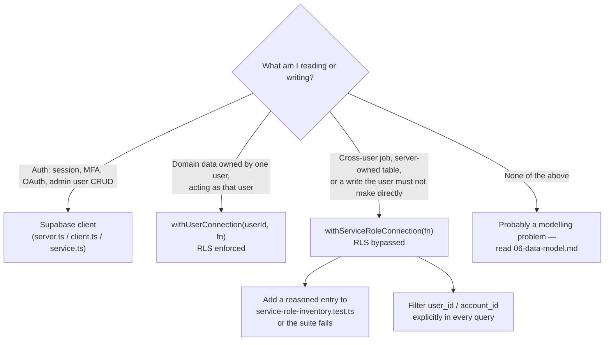
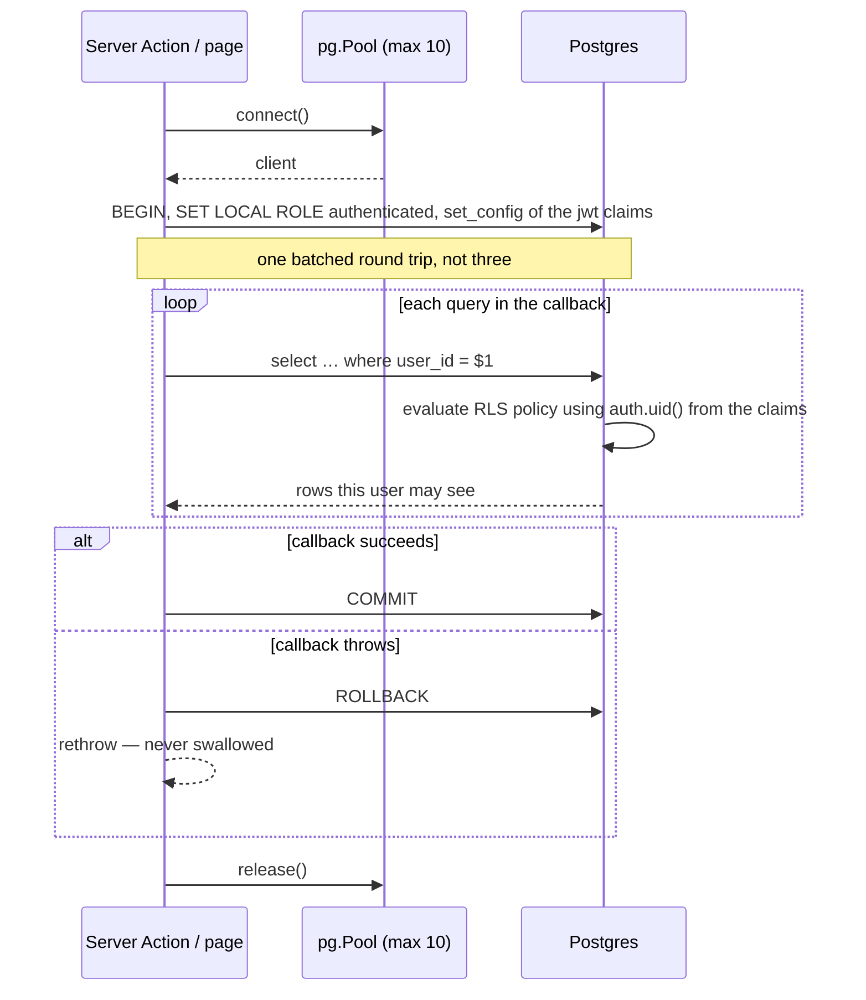
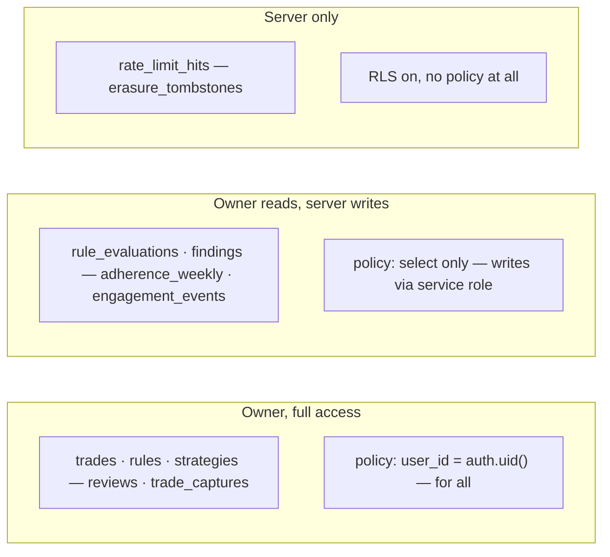

# Data access

> The one page to read before writing any query. Skipping it is what makes
> a newcomer reach for `.from()` and lose an hour to an error message that
> looks like a permissions bug and isn't.

Everything about how this app talks to Postgres follows from one fact:
**the `retrospeq` schema is not exposed to PostgREST.** The Supabase
client cannot see a single table in it. Domain data is reached over a raw
`pg` connection instead, through two helpers in
`lib/supabase/direct.ts`, and those helpers are what make row-level
security genuinely enforced rather than merely trusted.

For where this sits in the wider request path, see
[Architecture](03-architecture.md). For the tables themselves, see
[Data model](06-data-model.md).

## Why `.from()` and `.rpc()` do not work

PostgREST only serves schemas listed in the project's **Exposed schemas**
setting. `retrospeq` is not one of them. A live probe against
`${SUPABASE_URL}/rest/v1/trading_accounts` returns:

```
406  PGRST106  "Invalid schema: retrospeq"
```

So this does nothing useful, no matter how the client is configured:

```ts
// Wrong. There is no `trades` table visible to PostgREST.
const { data } = await supabase.from('trades').select('*');
```

This is a deliberate boundary, not an unfinished setup step. Exposing the
schema would mean re-deriving the whole access model through PostgREST's
role handling, on top of the policies already written for it. The
reasoning is in `docs/adr/0006-account-writes-direct-postgres.md`, which
builds on ADR 0003 (the rate limiter hit the same wall first) and ADR
0005 (why credential writes are service-role-only).

**The Supabase JS clients still have a job** — `lib/supabase/client.ts`,
`server.ts` and `service.ts` handle *auth mechanics only*: sign-up,
sign-in, session refresh, MFA enrolment, OAuth exchange, and the admin
API for creating and deleting users. They never carry domain data.

## The two helpers

Both live in `lib/supabase/direct.ts` and both wrap exactly one
transaction: commit on success, roll back and rethrow on any error, never
a half-applied write. Unlike the rate limiter — which deliberately fails
*open* on a database error, per ADR 0004 — this module never swallows
one.

### `withUserConnection(userId, fn)` — RLS enforced for real

```ts
await withUserConnection(user.id, async (client) => {
  const res = await client.query(
    'select id, instrument from retrospeq.trades where user_id = $1',
    [user.id],
  );
  return res.rows;
});
```

It acquires a pooled connection, sets the role to `authenticated`, and
sets `request.jwt.claims` so `auth.uid()` resolves to `userId` — exactly
how PostgREST resolves a real authenticated request. Every statement the
callback runs is therefore subject to the same policies a direct API call
would face.

The `user_id = $1` filter above is **defence in depth, not the
protection**. RLS is the protection. Both are written anyway, so a policy
mistake and an application mistake have to coincide before data crosses a
tenant boundary.

**The preamble is one round trip, deliberately.** `BEGIN`, `SET LOCAL
ROLE` and `set_config` are issued as a single batched statement. As three
separate queries they cost three network round trips *before any real
work*, and `/review` makes roughly fifteen such calls — about 8.1 seconds
of pure ceremony on a database ~112 ms away. Collapsing it halved every
page. A batched statement cannot take bind parameters, so the claims JSON
is escaped with `pg`'s own `escapeLiteral`; `role` is one of two
compile-time literals and never caller input.

### `withServiceRoleConnection(fn)` — RLS bypassed

```ts
await withServiceRoleConnection(async (client) => {
  await client.query(
    'update retrospeq.trades set confirmed_at = now() where id = $1 and account_id = $2',
    [tradeId, accountId],
  );
});
```

Sets the role to `service_role`, which bypasses RLS entirely. Used by the
paths that legitimately act across a user's data without a user session:
sync, close-out, the analytics engines, the weekly job, erasure.

Inside one of these, **explicit `user_id` / `account_id` filters are the
only thing standing between tenants.** RLS is bypassed, not replaced by
an equivalent check.

## When the service role is allowed

Every call site is enumerated in
`lib/supabase/__tests__/service-role-inventory.test.ts`, each with a
written reason. The test scans the codebase for calls and fails if it
finds one the allowlist does not name.

That makes widening the boundary a deliberate act with a paper trail:
adding a call site fails the suite until you also add the entry
explaining why it needs to bypass RLS. The test cannot judge whether your
reason is *good* — a reviewer does that — but it guarantees the reason
exists and was written down.



## Inside `withUserConnection`



The role and claims are set with `SET LOCAL`, so they last exactly as
long as the transaction. **The client must not escape the callback**: once
released it goes back to the pool and the next borrower gets a connection
with no role set. Return data from the callback, never the client.

## The three RLS shapes



**Owner, full access.** The default. The user owns the row and may read
and write it: their trades, rules, strategies, captures. One policy,
`user_id = auth.uid()`, `for all`.

**Owner reads, server writes.** The user may see it but must not author
it, because the value comes from computation rather than input: frozen
rule evaluations, findings, adherence rollups, the XP ledger. A `select`
policy and *deliberately* no write policy — writes go through the service
role. Each such migration says so in a comment, because a missing write
policy otherwise looks like an oversight.

**Server only.** No policy for any client role, so no client can read or
write at all. `rate_limit_hits` (written by a `SECURITY DEFINER`
function) and `erasure_tombstones` (a hash proving an erasure happened —
if it were readable it would leak the fact of the erasure).

A new table must pick one of these three shapes, enable RLS, ship a real
policy, and carry an RLS isolation test. `scripts/security-grep.mjs`
fails the build if a new table appears in a migration without both
`enable row level security` and a `create policy` in the same file.

## Operational details that bite

**Pool sizing.** `max: 10`. It was 3, which throttled every page that
fans out — `/review` assembles five independent reads in a `Promise.all`
and they queued three at a time.

**Fail fast, don't hang.** `connectionTimeoutMillis` and
`statement_timeout` are set because a request once hung for **15.1
minutes** against the direct IPv6 endpoint before anyone noticed, taking
the dev server with it. An unreachable database should surface as an
error a caller can report, not a page that never finishes rendering.

**Use the session pooler.** `SUPABASE_DB_URL` should be the session
pooler connection string, not the direct `db.<ref>.supabase.co` host.
That endpoint produced `EHOSTUNREACH`, an E2E `ETIMEDOUT`, and the hang
above. The pooler caps clients at 15, which is why the pool is 10.

**Live tests need a longer hook timeout.** Seeding and cleanup in
`beforeAll`/`afterAll` routinely exceed Vitest's 10-second default
against a remote database; `vitest.config.ts` sets `hookTimeout` to 30
seconds. See [Testing](12-testing.md).

**Numbers come back as strings.** `pg` returns `numeric` as a string to
avoid float precision loss, and nothing here overrides that. Money and
R-multiples go through `decimal.js` — never `Number()`, never `parseFloat`.

```ts
import { Decimal } from 'decimal.js';
const r = new Decimal(row.r_multiple);   // '1.5000' -> Decimal
```

**Timestamps are normalised.** `lib/supabase/pg-type-parsers.ts` reshapes
`timestamp`/`timestamptz` output into true ISO-8601, so a value looks the
same whichever path read it. It is imported for its side effect only and
mutates a process-wide registry, which is intentional — every `pg`
connection in the process gets it, including tests.
