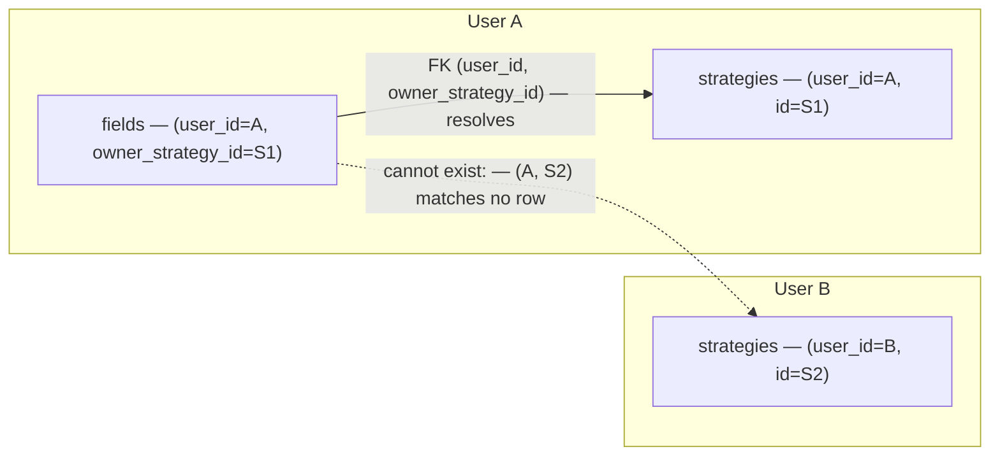
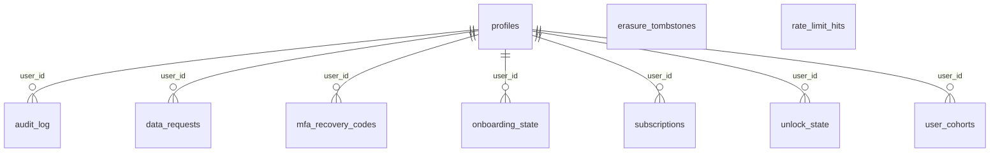
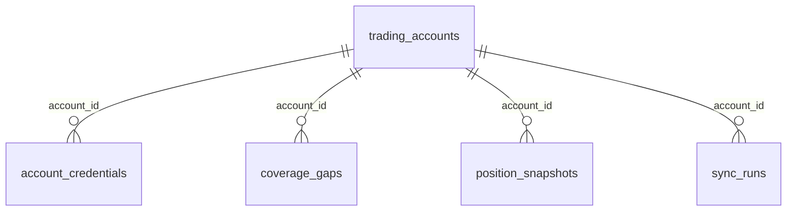
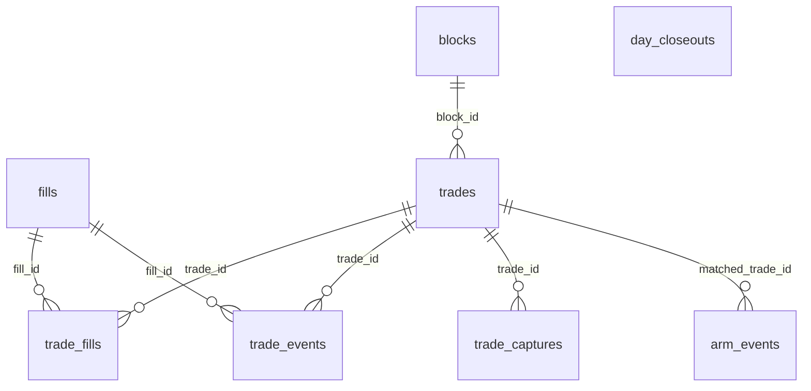
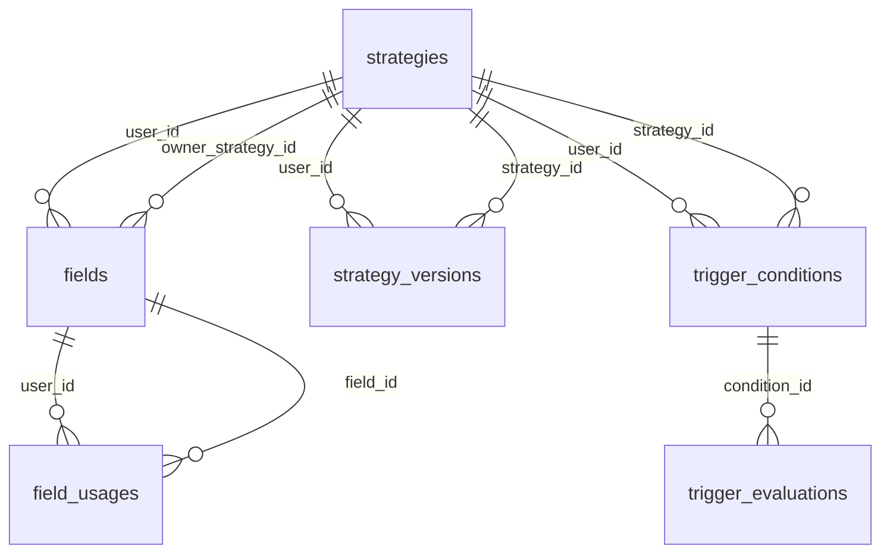
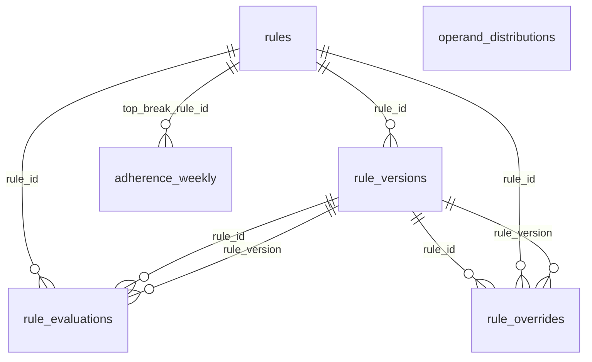
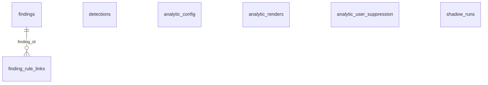
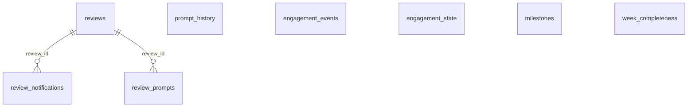

# Data model

Fifty tables in the `retrospeq` schema, reached only through the helpers
in [Data access](05-data-access.md) — never through PostgREST. This page
is the map: what the tables are, how they hang together, and which
product rules the database itself enforces rather than trusting the
application to remember.

## The shape in one sentence

Hub and spoke on `profiles`: almost every table carries
`user_id → profiles(id) on delete cascade`, and `profiles.id` in turn
references `auth.users(id)`. There are a handful of secondary hubs —
`trading_accounts`, `trades`, `strategies`, `rules`, `findings`,
`reviews` — but tenancy always traces back to one row.

## Cross-tenant references are structurally impossible

The obvious way to relate two tables is a plain foreign key on the child
id. This schema usually does something stricter: parents declare
`unique (user_id, id)` and children reference **both** columns.

```sql
-- strategies
unique (user_id, id)

-- fields, referencing it
foreign key (user_id, owner_strategy_id)
  references retrospeq.strategies (user_id, id)
```

A row therefore cannot point at another tenant's row *at all* — not
because a policy forbids it, but because the foreign key would not
resolve. Row-level security and the application's own `user_id` filters
sit on top of that as second and third layers.



Tables using this pattern: `fields`, `strategy_versions`, `field_usages`,
`trigger_conditions`, `findings`.

## Migrations

Timestamped filenames in `supabase/migrations/`, applied in filename
order, forward-only — there are no down migrations. Non-obvious
constraints carry an inline comment explaining what they protect, because
the constraint is usually the only place that rule is written down.

Apply them as described in [Getting started](02-getting-started.md). Note
that `supabase db push` prompts for confirmation and will hang an
automated run; the repo applies them with a small script instead.

## The tables, by domain

Each diagram shows only the foreign keys *within* its group. Nearly every
table also has `user_id → profiles(id)`, omitted here because drawing it
fifty times would obscure everything else.

### Identity, billing and privacy



### Broker accounts and sync



### Ingestion — fills to trades



### Fields and strategies



### Rulebook and adherence



### Analytics and findings



### Review and engagement



## Immutability triggers

Fifteen triggers across nine tables refuse writes that would rewrite
history. They exist because the product's credibility depends on some
records being unchangeable: an adherence figure means nothing if the
evaluation behind it could be edited afterwards.

| Table | Forbids | Why |
|---|---|---|
| `rule_evaluations` | UPDATE, DELETE | Evaluations freeze at close-out and are never recomputed. This is the product's central promise. |
| `trigger_evaluations` | UPDATE, DELETE | Same rule, for strategy trigger conditions. |
| `engagement_events` | UPDATE, DELETE | Append-only XP ledger — a balance you can edit is not a ledger. |
| `rule_versions` | UPDATE | Versions are immutable; only the supersession stamp may be written. |
| `strategy_versions` | UPDATE | Same shape. |
| `rules` | DELETE | Rules retire, they do not disappear — retiring keeps the history that referenced them. |
| `trades` | DELETE (broker-confirmed), UPDATE (regrouping after freeze) | A confirmed trade is evidence; regrouping it would silently change past evaluations. |
| `trade_captures` | UPDATE (pre-entry, after lock) | A pre-entry answer edited after the fact is no longer pre-entry. RLS cannot express "forbid writes after a timestamp on a related row". |
| `fields` | UPDATE, DELETE (derived fields) | Derived fields are part of the catalogue, not user content. |
| `onboarding_state` | UPDATE (stage regression) | Progress does not run backwards. |

**The one legitimate way past them** is erasure. Each trigger stands down
when `retrospeq.erasure_in_progress` is set inside the transaction, which
is why erasure has to delete explicitly rather than relying on cascades —
see [Privacy](09-privacy.md). A new immutable table means a new explicit
delete there; forgetting it breaks account deletion for anyone with a row.

## Invariants the database enforces

These are product rules expressed as constraints, so they hold even if
the application forgets them.

| Invariant | Enforced by |
|---|---|
| One weekly email per user per period, ever | `review_notifications` unique `(user_id, period_start)`, claimed **before** any send — a crash after the claim cannot double-send |
| A fill belongs to at most one trade | `trade_fills` unique `(fill_id)` |
| One live version per rule / strategy | partial unique on `superseded_at is null` |
| An evaluation always points at a real version | composite FK `(rule_id, rule_version)` |
| Replaying a job cannot double-award XP | `engagement_events` unique `(user_id, kind, subject_type, subject_id)` |
| A broker fill is ingested once | `fills` unique `(account_id, provider_ref)` |
| One connected account per platform identity | `trading_accounts` unique `(user_id, platform, provider_ref)` |
| One review per period | `reviews` unique `(user_id, period_kind, period_start)` |
| One evaluation per trade per rule | `rule_evaluations` unique `(trade_id, rule_id)` |
| One default strategy per user | partial unique where `is_default and state = 'active'` |
| One active finding per tuple | partial unique on `state = 'active'` |
| Credentials cannot exist unverified | `check (verified_readonly = true)` — the row is unstorable otherwise |
| The free-tier rule cap | guarded `insert … where (select count(*) …) < cap`, under an advisory lock |

That last one is worth reading closely in
`lib/rules/rules-repository.ts`: the friendly pre-check in the action is
*not* the enforcement. A guarded INSERT under `pg_advisory_xact_lock` is,
because two concurrent creates would otherwise both pass a pre-check.

## Adding a table

1. Pick one of the three RLS shapes in [Data access](05-data-access.md).
2. `enable row level security` **and** a real policy, in the same
   migration — `scripts/security-grep.mjs` fails the build otherwise.
3. Add an RLS isolation test. The bar is every table, not a sample.
4. Use the composite `(user_id, id)` pattern if anything will reference it.
5. Decide whether it needs an immutability trigger — and if it gets one,
   add an explicit delete to erasure.
6. Add it to the export registry if it holds user data
   ([Privacy](09-privacy.md)).
7. Add it to the right diagram above.
