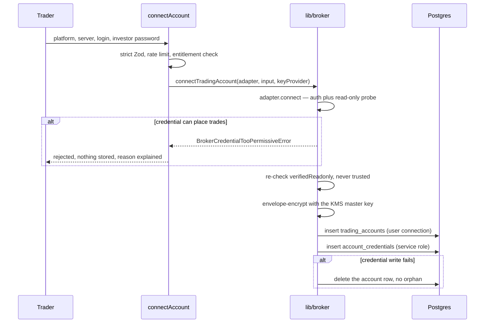
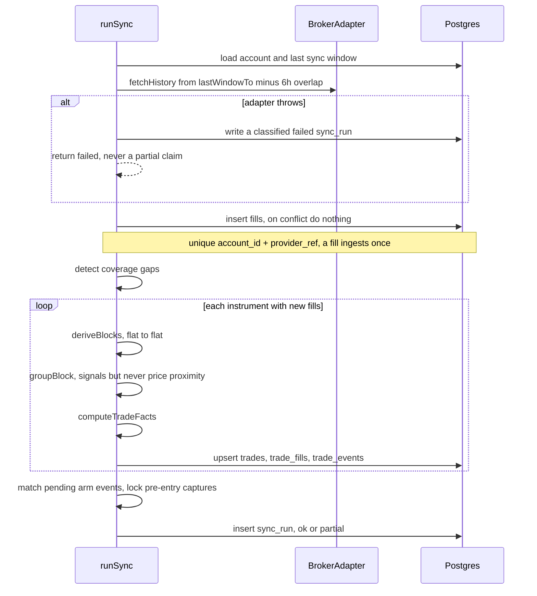
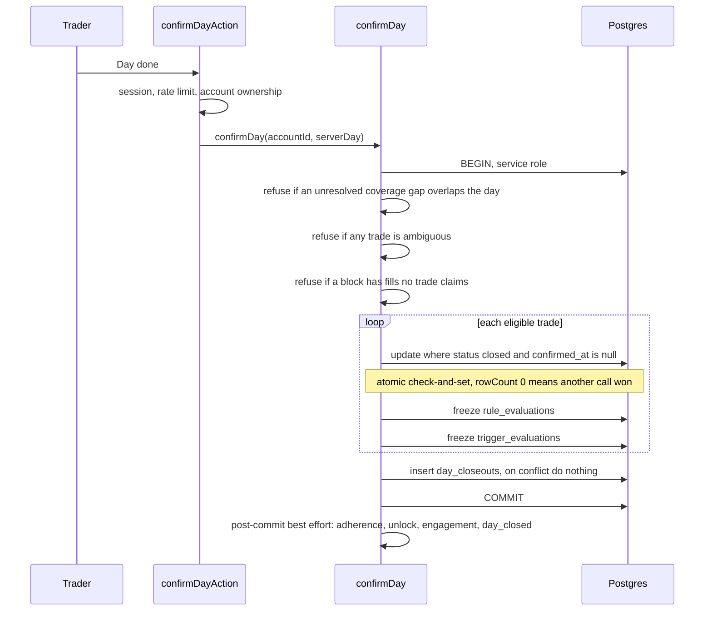

# Flows — capture

How a trade gets into Retrospeq and becomes evidence: connect an account,
sync fills, group them into trades, close out the day, freeze the
evaluations. Everything in [Flows — insight](08-flows-insight.md) reads
what this side produces.

The freeze point in the third flow is the most important line in the
product. Read that section even if you skim the rest.

## Connect an account

**What matters here**

- The read-only probe happens inside `adapter.connect()`, and the result
  is re-checked afterwards. An adapter that forgot to throw still cannot
  get a writable credential stored.
- The database agrees: `account_credentials` carries
  `check (verified_readonly = true)`, so an unverified row is unstorable.
- Credentials are envelope-encrypted with an external KMS master key.
  None is configured today, so `KmsNotConfiguredError` propagates and the
  credentialed path fails loudly rather than falling back to something
  weaker. Manual accounts work end to end.
- The credential write uses the service role because
  `account_credentials` has no client write policy at all (ADR 0005).

## Sync — fills to trades

**Blocks, then trades.** A *block* is a run of fills from flat to flat on
one instrument. Inside a block, the grouping engine decides how many
distinct decisions it represents — one trade, or several. Grouping reads
timing, direction and size relationships; **price proximity is banned**.
That is a non-negotiable, not an oversight: two entries at a similar
price can be entirely unrelated decisions.

When it cannot tell, it says so — `grouping_confidence = 'ambiguous'`,
which blocks close-out until the trader resolves it. Guessing would
silently corrupt every number downstream.

**After the commit** a fan-out runs best-effort: operand distributions,
the edge engine, then decay checks, then detections, then the weekday
canary. Each is independently caught, so none can fail the sync. The
order matters in exactly one place — decay reads freshly written
findings, so it must follow the edge engine.

## Close out, freeze, adherence

This is the one-way door.

**Why freezing matters.** A rule evaluation records what was true *at the
moment the trade was confirmed*, against the rule version live at that
time. It is never recomputed. Edit a rule tomorrow and past adherence
does not move — which is the entire point. A number that changes
retroactively is not a record of behaviour.

Two database triggers enforce it (`forbid_update`, `forbid_delete`), so
even a direct SQL mistake cannot rewrite history. The only way past them
is erasure, which is why erasure has to delete explicitly — see
[Privacy](09-privacy.md).

**Three refusals before anything is written**, checked up front rather
than after a wasted submit: an unresolved coverage gap overlapping the
day, an ambiguous trade, or a block with fills no trade claims. Each
names what to fix.

**Point-in-time rule selection.** Only rule versions live when the trade
*opened* are evaluated — created before it, not yet superseded. A rule
written today does not retroactively judge last week.

**Anomalies never fabricate.** If a rule cannot be evaluated — a corrupt
expression, a field archived after authoring — it is logged loudly and
recorded as an anomaly, and **no row is written**. The trade still
confirms. A missing evaluation is honest; a guessed one is not.

## Where this is tested

- Grouping: golden-fixture replay plus property tests on the invariants.
  Anything touching grouping replays the fixtures.
- Close-out and freeze: `confirm.live.test.ts` and
  `freeze-evaluations.live.test.ts`, against a real database, including
  the concurrent-confirm race.
- Connect: `lib/broker/__tests__/`, with the too-permissive credential
  path asserted explicitly.
