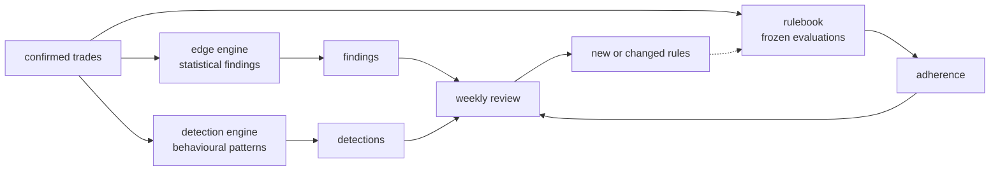
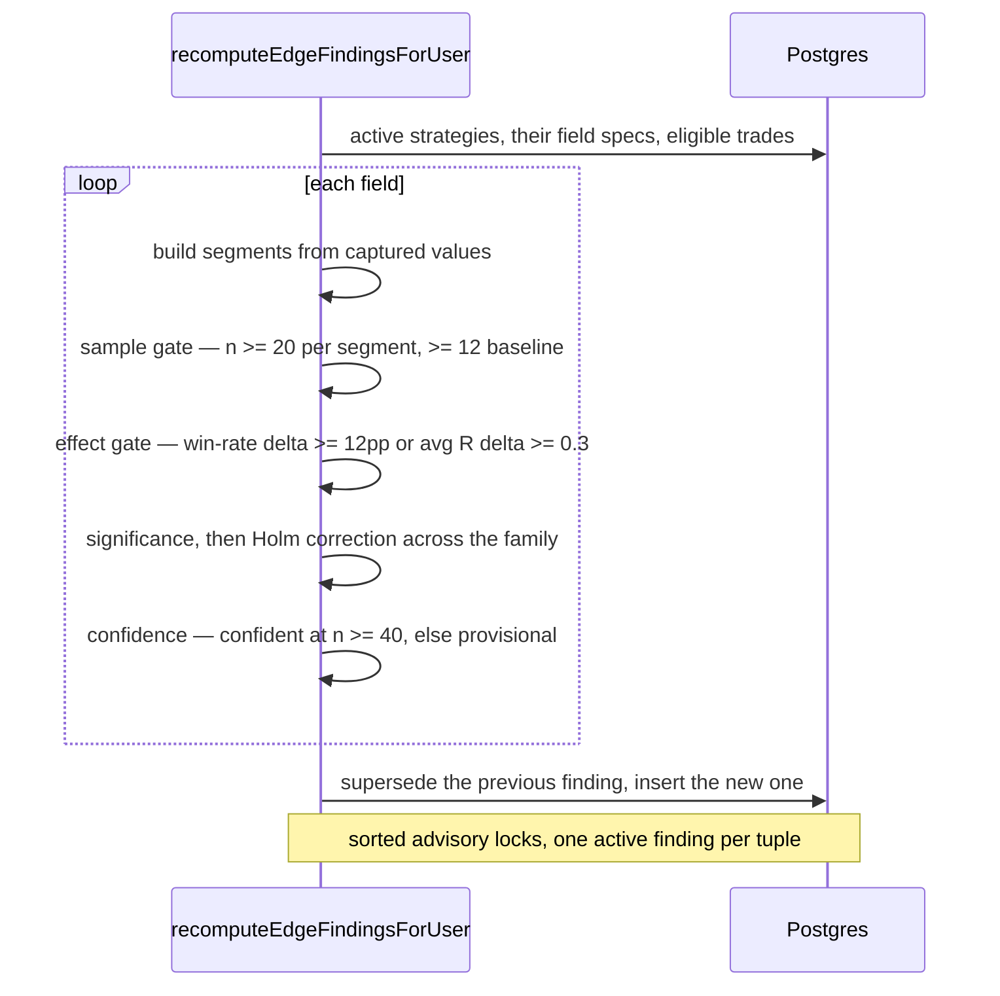
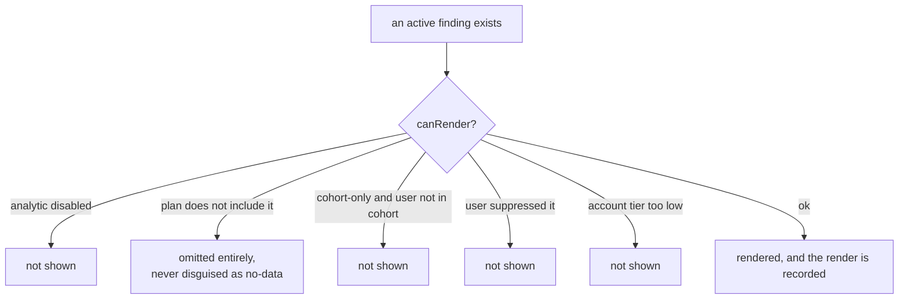
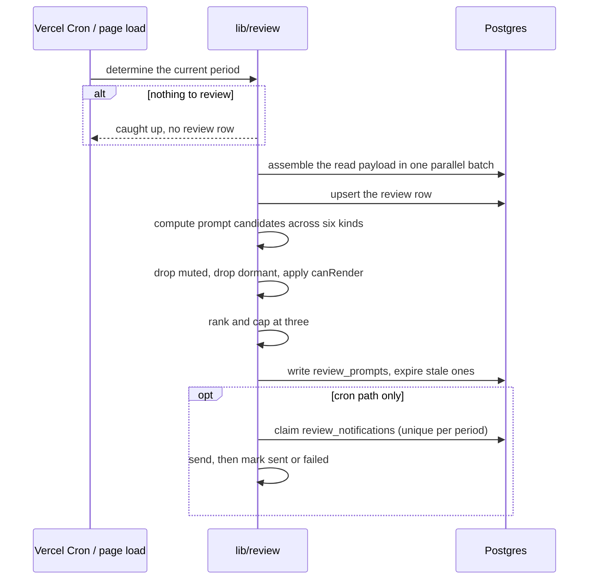
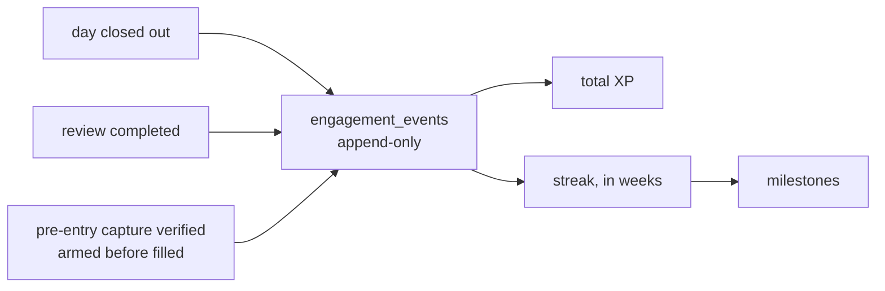

# Flows — insight

What the product does with confirmed trades: compute findings, detect
patterns, assemble the weekly review, put decisions to the trader, and
award the one thing it awards. Everything here reads what
[Flows — capture](07-flows-capture.md) produced.

## The two engines, and why they do not talk

`lib/analytics` never imports `lib/rules`. A finding has to be derivable
from what happened, without knowing what the trader committed to —
otherwise the evidence and the commitment contaminate each other, and
"your rule is working" becomes circular. The boundary is enforced three
ways; see [Architecture](03-architecture.md).

## Edge engine — findings

For each strategy, for each field it captures, the engine segments the
trades and asks whether a segment genuinely differs from the baseline.

**The gates are the product.** Three of them, in order: enough data,
a difference big enough to act on, and statistical significance corrected
for the fact that testing many fields at once manufactures coincidences.
Anything that fails a gate is not a weaker finding — it is not a finding,
and the screen says "not enough data yet", which is a correct state.

Crypto strategies suppress the session and day-of-week fields entirely: a
market that never closes has no meaningful session. Suppressed results
still compute, into `shadow_runs`, so the decision stays reviewable.

## Detection engine — patterns

Separate from findings. A detection is behavioural — re-entering within
90 seconds of a loss, trading more per day than usual, consecutive
losses, breaching a daily loss, unusually spread risk. It needs volume
(at least 5 occurrences), persistence (3 distinct days *and* 2 calendar
weeks), and a 90-day window.

The improvement half looks for the opposite: a pattern that used to
persist and has been absent for 28 days. That one exists so the product
can notice a trader getting better, not only worse.

## Rendering is gated separately

Computing a finding and showing it are different decisions.

`canRender` fails **closed**: a missing config row, an unreadable
database, any error at all resolves to "do not show", never to a default
on. The plan branch matters for honesty — a finding withheld because of
the trader's plan is omitted, not shown as "not enough data yet", which
would be a lie about their data.

## The weekly review

Materialised in two places that share the same three calls: when the
trader opens `/review` (compute-on-view, ADR 0039) and when the Monday
cron runs.

**Three prompts, maximum.** A review that asks twelve questions gets
none of them answered properly. Ranking decides which three.

**A missed week does not compound.** The next period simply covers two
weeks, and the review says so.

**Exactly one email.** The claim row is inserted *before* the send, so a
crash between claiming and sending fails closed. There is no automatic
retry: a network drop after the request left the process is
indistinguishable from a rejection, and a double-send is worse than a
missing one. A missing email is not a missing review — `/review` still
renders.

## Decisions

Five families. Every accept re-verifies live state rather than trusting
the prompt that was materialised days ago.

| Family | The question | Accepting writes |
|---|---|---|
| Graduation | This finding is strong. Make it a rule? | a new soft rule, linked to the finding |
| Relaxation | You keep breaking this. Which is true — recommit, or adjust it? | a new rule version, or nothing |
| Promotion | You have followed this for six weeks. Make it hard? | severity change |
| Retirement | This rule's evidence has decayed. Retire it? | rule state change |
| Detection | This pattern keeps happening. Rule about it? | a new rule from the pattern |

If the world moved — the finding superseded, the pattern gone, the rule
already changed — the accept returns a *gone* result and the trader is
told, rather than acting on stale evidence. One accept path even retires
the duplicate rule it created if it loses a double-submit race.

**"Not yet" is a real answer**, recorded as a decline. Declining twice
mutes that subject: the product asks, listens, and stops asking.

## Engagement

XP comes only from things the trader genuinely did and the system can
verify. **Adherence earns none** — deliberately (ADR 0044). Rewarding
rule-following would turn an honest self-report into a score to game, and
the one number this product must not corrupt is whether you actually
followed your own rules.

Streaks count **weeks**, not days, with one grace week per quarter. The
ledger is append-only with an idempotency key, so replaying a job cannot
double-award.

## Where this is tested

- Engines: unit tests on the gates and statistics, live tests for the
  supersede-then-insert write path and its advisory-lock ordering.
- Review: `lib/review/__tests__/` — materialisation, ranking, expiry, and
  the exactly-once notification claim under concurrency.
- Decisions: live integration tests per family, including the
  double-submit race and the stale-evidence refusals.
