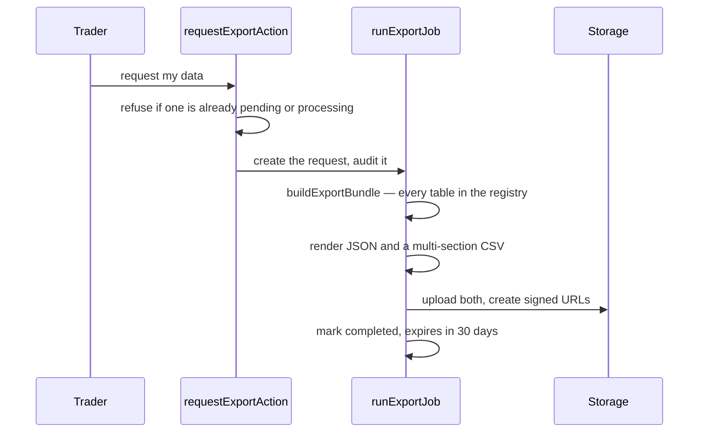
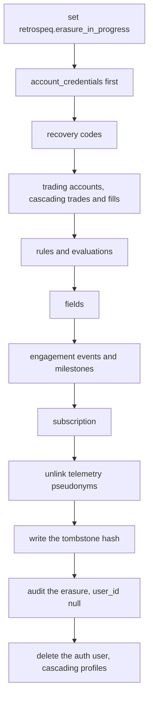

# Privacy

Export, erasure and restriction. Three request types, one table
(`data_requests`), and one ordering problem that is more interesting than
it looks.

## Export

**The registry is the contract.** `EXPORT_TABLE_REGISTRY` names every
table carrying user data and what to select from it. Tables are either in
it or on a documented exclusion list — encrypted credentials and recovery
code hashes (security material, never exported) and internal analytics
bookkeeping. A test fails the build if a table with a `user_id` column is
in neither list, so a new table cannot silently go missing from exports.

Two formats, because they answer different questions: JSON preserves
structure, CSV opens in a spreadsheet. Every cell in the CSV is
neutralised against formula injection — a strategy named `=HYPERLINK(...)`
is data, not something Excel should execute — and plain numbers are left
alone so `-1.5` stays `-1.5`.

Each table is capped at 50,000 rows and says so when truncated, rather
than silently returning less than everything.

## Erasure

Seven-day grace period, cancellable throughout. Then:

**Why the order is explicit** rather than a cascade. Several tables carry
`forbid_delete` triggers — frozen evaluations, the append-only XP ledger.
A cascade reaching one of those aborts the whole deletion. So erasure
sets `retrospeq.erasure_in_progress` inside its transaction, which is the
only condition under which those triggers stand down, and deletes the
protected tables by name in dependency order (ADR 0010).

**This has broken three times**, each time the same way: a new immutable
table shipped, nothing added it to the delete list, and account deletion
failed for anyone with a row in it. `fields`, then `rules`, then
`engagement_events`. If you add a table with a `forbid_delete` trigger,
add its delete here and a regression test that seeds a row and erases.

**Credentials die first**, before anything else can fail. **The
tombstone** is a hash of the email proving an erasure happened; it is
server-only with no read policy, because being able to read it would leak
the fact of the erasure. **The audit row** is written with a null
`user_id` so it outlives the profile it describes.

## Restriction

A lighter alternative: stop processing without deleting. The account
stays, processing stops, and it is reversible. Used when a trader wants
out of the analytics but not out of their history.

## Telemetry

Off is a real off. `profiles.telemetry_opt_out` gates the pseudonymous
telemetry, and erasure unlinks the pseudonyms regardless. The weekly
email has its own separate opt-out, because consenting to one is not
consenting to the other.

## Where this is tested

`lib/privacy/__tests__/` — including live erasure tests that seed rows in
the protected tables first, so the trigger paths are genuinely exercised
rather than assumed. The export registry's completeness check is a test,
not a convention.
