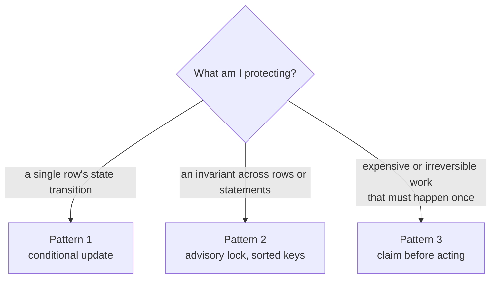

# Concurrency

Three patterns recur throughout this codebase. They are not
interchangeable, and picking the wrong one produces bugs that pass every
test and fail in production once two things happen at the same moment.

Each exists because a real race was found here, in review or in a live
test — none is theoretical.

## Pattern 1 — conditional update, check and set

Use when the state transition *is* the lock.

```sql
update retrospeq.trades
   set confirmed_at = now(), status = 'confirmed'
 where id = $1 and status = 'closed' and confirmed_at is null
```

Then check `rowCount`. Zero means someone else got there first, which is
not an error — it is the answer. Close-out uses this per trade, so two
concurrent confirmations produce exactly one confirmation and no
duplicate evaluations.

**Why not read-then-write:** between the read and the write, the other
transaction commits. The check has to be part of the write.

## Pattern 2 — advisory lock, in a deterministic order

Use when an invariant spans several statements or rows and a conditional
update cannot express it.

```ts
await client.query('select pg_advisory_xact_lock(hashtext($1))', [key]);
```

The engines use this when superseding findings: read the current active
row, mark it superseded, insert the replacement. Three statements that
must not interleave with another run doing the same thing.

**Sort the keys before acquiring.** Two transactions taking the same two
locks in opposite orders deadlock. The findings writer sorts by
`fieldId + segment` before locking, and the detections writer iterates a
fixed constant order, for exactly this reason.

## Pattern 3 — claim before acting

Use when the winner must be decided *before* expensive or irreversible
work.

```sql
insert into retrospeq.review_notifications (user_id, period_start, ...)
values ($1, $2, ...)
on conflict (user_id, period_start) do nothing
returning id
```

No row returned means someone already claimed it. The weekly email claims
before sending, so a crash between claiming and sending fails closed —
the email may be missed, but it cannot be sent twice. Given the choice,
this product misses rather than duplicates.

The XP ledger uses the same shape with an idempotency key, so replaying a
job cannot double-award.

## Choosing



## Two things that surprise people

**`FOR KEY SHARE` and `FOR NO KEY UPDATE` do not conflict.** A guarded
`UPDATE ... WHERE NOT EXISTS` can still race a concurrent INSERT. The
weekly review's "refuse to close while prompts are pending" needed a row
lock shared with the prompt writer, not just a clever WHERE clause.

**Post-commit side effects are not in your transaction.** Adherence
recomputes, engagement events and analytics fan-outs all run *after* the
commit, each independently caught. That is deliberate — they must not
fail the user's action — but it means they can run against a world that
has already moved on. Write them to be idempotent.

## Testing a race

Two connections, a barrier, and an assertion that exactly one won. The
established technique here polls `pg_stat_activity` until Postgres itself
confirms the second connection is genuinely blocked on the lock, then
releases the first — event-driven rather than a sleep, so it does not
pass by accident on a fast machine. See
`lib/ingestion/__tests__/split-join.live.test.ts` for the reference
implementation.
