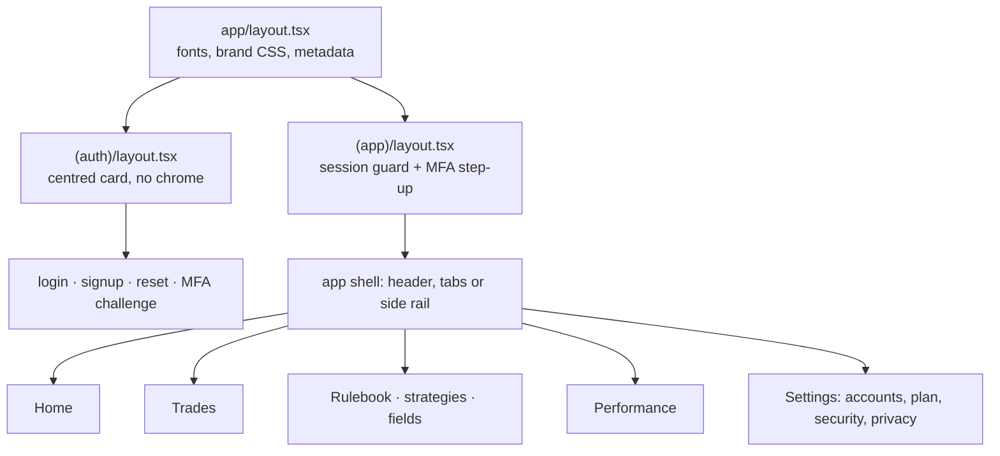

# Frontend

Server Components by default, Server Actions for every write, and a
design system loaded as plain CSS with no build step. There is no client
data fetching, no state manager, and no component library.

## Route groups



`(app)/layout.tsx` is the real auth boundary — see
[Architecture](03-architecture.md). Four tabs, and Settings behind the
gear rather than competing with them.

## The Server Action contract

Every action follows the same shape, in this order:

1. `.strict()` Zod parse — unknown keys rejected, not ignored.
2. Session from the cookie, never from the payload.
3. Rate limit, by named scope.
4. Entitlement check where a capability applies.
5. Ownership check on anything the client named.
6. The write, through a connection helper.
7. `revalidatePath` so the server component re-renders.

Actions **return** typed error results rather than throwing across the
RSC boundary:

```ts
return { error: { code: 'RULE_LOOSER_THAN_GLOBAL', user_message: '…', retryable: false } };
```

The UI renders `user_message` and never invents its own copy for a server
refusal. A form binds with `useActionState`; that is the only reason most
client components exist.

## When a component may be a client component

Pathname, local UI state, or an effect. That is the list. A page that
merely renders data stays a Server Component and reads directly from
`lib/`. Client islands live beside their page and are named for what they
do — `ConfirmDayForm`, `TrimReasonChips`, `RuleEditor`.

## The design system is wired twice, deliberately

| Path | What it is |
|---|---|
| `retrospeq-design-system/brand/` | **The source.** Tokens, CSS, fonts, the 76-frame mockup. |
| `public/brand/` | A copy, served statically and loaded by a plain `<link>`. |
| `app/brand-tokens/` | A copy, mapping the same tokens into Tailwind utilities. |

Edit the source and re-sync all three. The `<link>` gives you `.rq-*`
component classes; Tailwind gives you `bg-bg`, `text-ink`, `border-line`.
Both resolve to the same `--rq-*` custom properties, so they cannot drift
in appearance. There is no build step for the design system, by its own
contract.

## Rules that look like bugs

Each of these has been "fixed" by someone who thought it was an
oversight. They are not.

- **One `.rq-btn` per view.** One screen, one obvious action. A second
  primary means the screen has not decided what it is for.
- **`.rq-btn--equal` pairs have no primary.** When two choices are
  genuinely equal ("recommit" vs "adjust"), styling one as primary is the
  product taking a side it has no business taking.
- **`.rq-num` on every number.** Tabular figures, so columns of numbers
  line up and a changing value does not shift the layout.
- **No red or green, anywhere.** Direction is geometry — a bar left or
  right of centre. There are no success or danger tokens to reach for,
  deliberately. A loss is not a failure and the interface must not say it
  is.
- **"Not enough data yet" is a designed state**, not an empty one. It
  appears on purpose and must never be replaced with a zero.
- **Hard and soft adherence are never blended** into one percentage.
- **No currency on Home.** R-multiples only.
- **Fast-capture screens take no keyboard** except the fields the spec
  names. Ratings are dots, values are steppers.

## Building a screen

Every screen has a frame in the mockup. Find its row in
`retrospeq-design-system/brand/docs/inventory.md`, which gives the file
and anchor, then build against that frame rather than freehand.

Use the `/design-build` skill to build or restyle and `/design-audit` to
review. They carry the distilled rules and the checklist, and they exist
because these conventions are too many to hold in your head.

**Look at what you built.** Screenshot it and read the image — at phone
width and desktop, in light and dark. Every UI bug found in this project
that tests missed was found by looking: buttons stacked invisibly on one
spot, a doubled percent sign, a pass mark on a gate with nothing behind
it.
