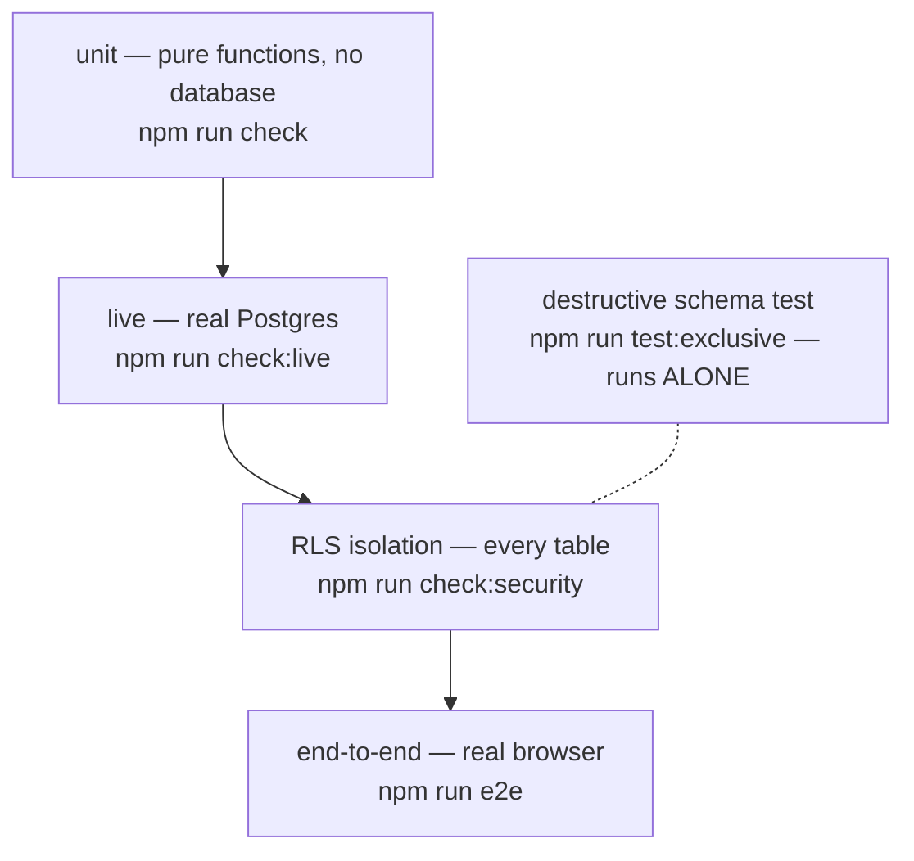

# Testing

Five layers, three traps. The traps have each cost real time here, so
they are stated loudly rather than left to be rediscovered.



| Layer | Pattern | Needs a database | Run by |
|---|---|---|---|
| Unit | `*.test.ts` | no | `npm run check` |
| Live | `*.live.test.ts` | yes | `npm run check:live`, `verify` at tier 2+ |
| RLS isolation | `*.rls.test.ts` | yes | `npm run check:security` |
| Destructive | one file | yes | `npm run test:exclusive` only |
| End-to-end | `e2e/*.spec.ts` | yes, plus a dev server | `npm run e2e`, `e2e:changed` |

The bar: 90% line coverage on the grouping, rule and statistics engines,
70% overall; property tests on grouping and rule-evaluation invariants;
RLS isolation on **every** table, not a sample; golden-fixture replay for
anything touching grouping.

## Which command

`npm run verify` classifies your change and runs the right subset. Use it
before handing anything off. `npm run classify` alone tells you the tier
and why — note it exits *with the tier as its status code*, so don't wrap
it carelessly in `set -e`.

## The three traps

**A `.tsx` test file is silently skipped.** The include glob is
`**/*.test.ts`. Name a component test `foo.test.tsx` and it passes by
never running. Write render tests as `.ts` and use `React.createElement`.

**A CLI `--exclude` replaces the config's exclude list, it does not add
to it.** This is why the destructive file is named in both
`vitest.config.ts` *and* in the `--exclude` flags of `check` and
`check:security`. Drop either copy and it runs in parallel again.

**One test file is destructive and must run alone.**
`analytics-registry-schema.independent-verify.rls.test.ts` drops CHECK
constraints and revokes a grant for the duration of an assertion.
Anything running beside it fails with "permission denied" — it once
produced 20 failures in a single sweep and was written off as a flake for
days. It has its own config and runs by itself.

## Live tests

They talk to a real database, so they are slower and they need real
fixtures. Two things worth knowing:

**Seed in bulk.** One `INSERT ... SELECT generate_series(...)` instead of
a loop. A 44-row loop against a remote database took 20 minutes and blew
both the test and cleanup timeouts; the same data in one statement took
9 seconds.

**Hook timeouts are 30 seconds**, not Vitest's default 10, because
seeding and cleanup routinely exceed it against a remote database.

## Test users

```bash
npm run test:user -- create my-label   # prints {id, email, password}
npm run test:user -- delete <id|email>
npm run test:user -- cleanup           # anything older than 6h
```

Confirmed accounts, so no email step. **Clean up after yourself** —
orphaned test users accumulate and slow everything down.

Deletion order matters and the script handles it: the profile goes first,
inside a transaction with `retrospeq.erasure_in_progress` set, or the
immutability triggers refuse; then the auth user.

## End-to-end

Playwright, real browser, real database. `npm run e2e:changed` picks the
one to three specs matching what you touched; the full suite is for phase
ends because it takes roughly 40 minutes.

**The rate-limit bypass.** Every E2E test signs in, and dozens of
sign-ins from one IP trips the app's own limit — a structural problem,
not a flaky test. `RETROSPEQ_E2E_RATE_LIMIT_BYPASS` exists for this: it
is fail-closed, requires `NODE_ENV !== 'production'`, and is read in
exactly one place (ADR 0042). Playwright sets it for a server *it*
starts; if you already have `next dev` running, export it in that shell
yourself or the suite will throttle.

## Writing a test that is worth having

The recurring failure here is not missing tests — it is tests that assert
the implementation rather than the behaviour. Three real examples:

- A test asserted an all-null day sums to "a real, honest 0". It locked
  in a bug: the honest answer was "unknown".
- A test asserted a fabricated shape rather than a real error type, so it
  passed against a fix that did not work.
- The custom-field slice tested parsing, catalogue construction and
  ownership — everything except the comparison, which was inverted.

Assert what the user gets. If the test would still pass with the feature
subtly wrong, it is not testing the feature.
