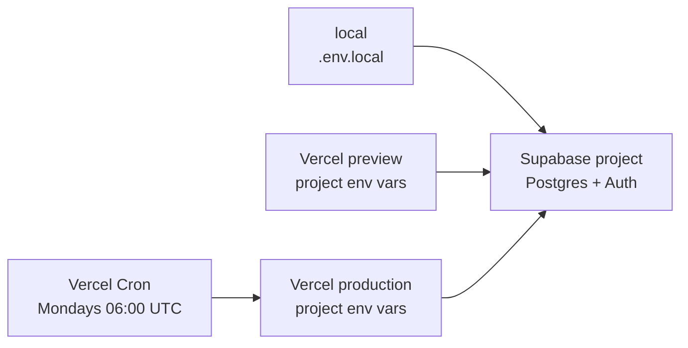

# Environments

Three places this runs: your machine, a Vercel preview, and Vercel
production. They differ only in configuration.

**Which project each points at lives in configuration, not here.** That
is deliberate: this file would go stale the moment a project moved, and
one already has. `.env.local` holds it locally, the Vercel project
settings hold it for deployments, and ADR 0045 records the arrangement
and why.

## Configuration

Every variable, what it does and what breaks without it is in
[Getting started](02-getting-started.md), with `.env.local.example` as
the template. Deployed environments need the same set, set in the Vercel
project rather than a file.

Two worth calling out:

- **`SUPABASE_DB_URL`** — use the *session pooler* connection string, not
  the direct host. The direct endpoint hung a request for 15 minutes on
  a developer machine and took the dev server with it. See
  [Data access](05-data-access.md).
- **`CRON_SECRET`** — the cron route refuses to run without it, returning
  503 and logging why. That is intentional: an open endpoint that emails
  every trader is worse than one that loudly does nothing.

## Migrations

Forward-only, applied in filename order, no automated runner. So the
deploy sequence is **migrate, then deploy** — a deploy that assumes a
column its migration has not applied will fail at runtime rather than
at build.

Locally, apply them as [Getting started](02-getting-started.md)
describes. Note `supabase db push` prompts for confirmation and will hang
an unattended run.

## The scheduled job

`vercel.json` schedules `GET /api/cron/weekly-review` for Mondays at
06:00 UTC. Vercel sends `Authorization: Bearer <CRON_SECRET>`; the route
compares in constant time, returns 401 for a wrong or missing header, and
503 if no secret is configured at all. It accepts no input of any kind,
so there is nothing for a caller to steer.

**Firing twice is safe.** The exactly-once claim lives in the database
(`review_notifications`, unique per user per period), not in the route,
so a duplicate delivery or a manual re-trigger only emails the people who
had not been emailed. See [Flows — insight](08-flows-insight.md).

## Secrets

Nothing credential-shaped may reach a log. `scripts/security-grep.mjs`
checks for it mechanically and fails the build. The same script verifies
that a new table in a migration ships both RLS and a real policy.

Broker credentials are envelope-encrypted with an external KMS master
key — never a static application key, never readable by a client. Where
no KMS is configured, the credentialed path throws
`KmsNotConfiguredError` rather than degrading to something weaker.

## What is not wired

Stated here so the behaviour is not mistaken for a bug: there is no
billing provider, so plan changes come from `subscriptions` rows set
directly or by the dev-only entitlement tool; and no external KMS, so
credentialed broker connect fails loudly while manual accounts work end
to end. Current status and follow-ups live in `docs/infra-gaps.md`, not
here.
